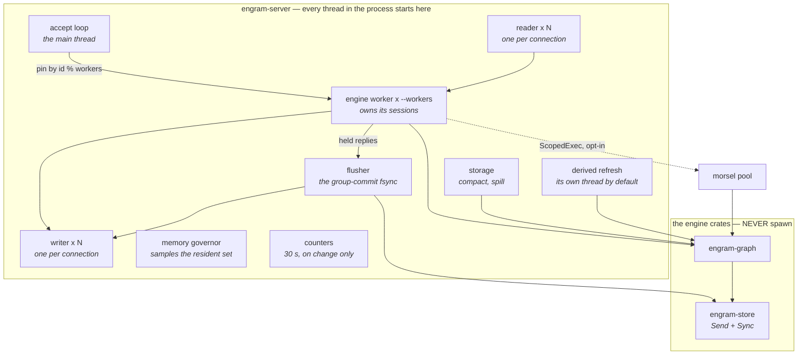

# Concurrency and the worker model

Engram is a **multi-threaded server over a shared MVCC store**, in which the
engine crates themselves never spawn a thread.

That distinction is the whole design, and it is easy to state wrongly. The rule
is not "single-threaded" — `--workers N` runs N engine threads and a statement
can split across morsels. The rule is that **every thread in the process is
created in one file.**

## Where the threads are

All in `engram-server`, the only crate carrying
`#![allow(clippy::disallowed_methods, disallowed_types)]`:

| thread | count |
|---|---|
| accept loop | 1 (the main thread) |
| reader | 1 per connection |
| writer | 1 per connection |
| engine worker | `--workers`, default 1 |
| flusher (the group-commit fsync) | 1, unless `--no-group-commit` |
| storage (compact, spill) | 1 |
| derived refresh | 1, unless `--no-split-maintenance` |
| memory governor | 1, unless `--memory-max-mb 0` |
| counters | 1 |

The flusher owns the group-commit sync, so no engine worker waits on the disk: a
worker hands its held replies over and takes its next batch. [The commit
log](./commit-log.md#group-commit) has the protocol.

The refresh has its own thread because it must not queue behind a compaction.
On a paged store a seal asks for storage every time, so a store past
`--compact-after` runs a merge that can take minutes, and with one thread the
refresh waits at the tail of the same loop while readers repair stale tables
themselves. `--no-split-maintenance` collapses them back, and is the arm that
reproduces it.

The memory governor samples the resident set against the ceiling: above 90% of
it new statements queue (and are refused after waiting 30 s), and below 80%
they are admitted again. The ceiling defaults to the container's own memory
limit. A process that cannot read its own resident set says so at start and
runs no governor.



`std::thread::spawn` is denied workspace-wide by `clippy.toml`. The adapter is
where the real world is allowed to exist, and it is one file deep.

## The D2 revision

D2 was originally *"one shard, one thread, cooperative tasks; the store is
`!Sync` on purpose."*

It was **revised on 2026-08-25**. The store is now `Send + Sync`, because
morsel-driven parallel execution and MVCC-OCC require it to cross threads.

The original argument for one thread was simulability — a shared-pool-plus-locks
design cannot be simulated, because the interleavings belong to the OS scheduler.
Losing that meant the integrity had to come from somewhere stronger, and the
source names the replacements: **result-determinism, interleaving search
(Loom/shuttle), and a serializability checker.**

## Connection pinning

A connection pins to worker `id % workers` and stays there. Consequences:

- A worker's session map is **its own** — no cross-worker map, no lock around it.
- One connection's statements are serialised with respect to each other, which
  is what a client expects.
- Load balance depends on connection distribution, not on work stealing. Eight
  connections across two workers is four each, however unequal their work.

## Isolation between workers

Workers share one store. What keeps them honest:

| mechanism | protects |
|---|---|
| **MVCC snapshots** | readers never block writers, writers never block readers |
| **OCC validation** at commit | both read set and write set, against the commit window |
| **Per-entity write latches** | 1,024 stripes — record-level lost updates |
| **Per-entity FIFO locks** | CAS ordering, and escalation targets |
| **64 sharded tail latches** | writers to different keys rarely contend |
| **The write fence** | a derived publish cannot claim a stamp above an in-flight writer |

Store state itself is an `Arc<RwLock<State>>` taken through one place — a
**coarse latch and a deliberate stepping stone**, in the source's own words.
Refining it so a reader on a snapshot never blocks a writer is later work; the
immutable sealed segments never need locking, only the mutable tail, the
timestamp counter, the pins and the locks do.

## Conflict escalation

Under sustained contention on one key, optimistic re-running is wasteful — every
contender burns a full execution to lose.

Escalation moves those contenders onto **FIFO entity locks** so they queue
instead of racing. On by default; `ENGRAM_CONFLICT_ESCALATION=0` turns it off.

The counters distinguish the outcomes: `escalations`, `escalated_losses`, and
the `won@N` attempt distribution.

## Morsel parallelism

Parallelism *inside* a statement enters through one trait:

```rust
pub trait ScopedExec: Send + Sync {
    fn width(&self) -> usize;
    fn for_each(&self, n: usize, f: &(dyn Fn(usize) + Sync));
}
```

Three implementors, and the middle one is the point:

| implementor | what runs |
|---|---|
| **absent** — the default, and always in the simulation lane | operators take their serial paths; one lever check on the hot path |
| `SerialExec` | width 1, inline — the *parallel machinery* (split, slot collection, ordered merge) run **deterministically** |
| the server's thread-scope pool | real OS threads, work-stealing off an atomic cursor, drawing from a process-wide slot budget, behind `ENGRAM_QUERY_PARALLELISM` |

Because the engine **asks** for parallelism rather than owning it, the morsel
machinery can be exercised single-threaded through the *same code path* the
parallel pool uses. The deterministic simulation therefore covers parallel
execution logic without threads. A database that owns its thread pool cannot
make that separation.

### The merge discipline

Partials are collected per morsel and concatenated **in morsel order**, so a
parallel run reproduces the serial output byte-identically — proven per operator
by an A/B differential with a fired-counter canary.

The discipline is the *operator's* obligation, not the trait's. The trait
promises only that every index in `[0, n)` has run before it returns.

### The budget is process-wide, and it degrades

The pool's threads are drawn from **`PARALLEL_SLOTS`, one budget for the whole
process**, not a width per statement. `for_each` asks for `width.min(n)` and
takes what is free; the grant is held in a guard whose `Drop` returns it, so an
unwinding body cannot leak a slot. The granted threads are not all started up
front. The calling thread starts claiming morsels at once, and one ramp helper
waits out `RAMP_AFTER` (250 µs); a run that finishes first sends it home
unused, so a tiny run starts no thread at all. After the ramp, helpers start
while the unclaimed morsels outnumber the helpers already started and not yet
claiming, up to the grant — counting *pending* helpers, because each new thread
claims as soon as it runs, and counting only live ones stopped growth at about
half the grant.

Without the budget, C concurrent clients produced up to `C × width` morsel
workers against a fixed CPU quota, and past a point that is not merely wasteful
but negative: the quota throttles the surplus threads, so the read-bearing
profiles' throughput peaks and then **falls** as clients are added, with their
tail latency climbing, while the write profiles — which do not parallelise the
same way and so never multiply — keep climbing. Reads saturating and then
declining while writes do not is the signature of oversubscription.

Three things about it are not obvious:

**It degrades, it never blocks.** `take_parallel_slots` is a CAS loop rather
than a semaphore, deliberately: waiting for a slot would convert oversubscription
into queueing delay and land the same cost in the p99 that is already the thing
suffering.

**Taking zero is a scheduling decision, never a correctness one.** A statement
granted nothing runs the plain serial loop, which is what the engine did before
parallelism existed. `ScopedExec` promises that `for_each` invokes `f` for every
index in `[0, n)` — not that any particular number of threads does the
invoking.

**It bounds amplification, not absolute concurrency.** A starved statement still
runs, on its own thread, so S concurrent statements always give at least S
bodies. The budget caps how many *extra* threads each of them may recruit. A
unit test asserts that as a differential (a tight budget shows materially less
concurrency than a loose one) after an earlier version of it asserted
`peak <= budget` and failed at 8 against 4 — the assertion was wrong, not the
pool.

The budget defaults to the configured width. `ENGRAM_PARALLEL_SLOTS` overrides
it and is the A/B arm: setting it to `width × clients` restores the unbounded
behaviour.

**A lone statement is unaffected.** It asks for `width` slots and is granted all
of them, so its path is the old one plus an uncontended CAS. The budget changes
what happens only when statements compete for cores: the second concurrent
statement finds the pool empty and runs serially instead of contending for the
same cores. It is a bound on concurrency, never a speed-up.

### Admission — expand

Five gates, each load-bearing:

1. the lever is on;
2. an executor is installed;
3. **no active transaction on this thread** — with one deliberate exception,
   below;
4. enough driving rows to beat the split's overhead (256);
5. no fold weights on the driving rows.

Gate 3 is the sharp one: the read-your-writes overlays and the OCC read set are
**thread-local**, so a morsel worker would silently read committed state and
record nothing. The exception is the graph-algorithm fixpoint, which is
deliberately not gated on it — see [What is not concurrent](#what-is-not-concurrent).

### Admission — the count fold

The fold has its own admission, and it is four gates rather than five: its own
lever, an installed executor, no active transaction on this thread, and enough
driving rows. The weights gate is `expand`'s alone — it is there because
`expand`'s morsel body does not carry the weight column.

Its row floor is **2**, not 256. A fold's driving row is an entire nested walk
rather than a cheap probe, so the constant that is right for `expand` is wrong
here by two orders of magnitude: LSQB q3 seeds on `country`, the LDBC social
network has 111 countries at every scale factor, and under a floor of 256 q3
would never parallelise at all.

The fold also cuts **finer than one morsel per worker** when no level memoises,
because its rows are wildly uneven — the most populous countries hold far more
persons than the least, and per-country work grows superlinearly, so `width`
contiguous chunks hand one worker the giant. The executor already pulls morsels off an
atomic cursor, so extra morsels cost nothing. With a memo-eligible level the cut
stays at one morsel per worker, since each morsel builds its own fold state and
finer cuts would rebuild the same memo.

The fold floor has **no CLI flag**: `Graph::set_parallel_fold_min_rows` is
in-process only.

### Read semantics, stated rather than assumed

A morsel worker reads exactly as the serial loop it replaces: read-committed per
row against the visible clock. A commit landing mid-statement can be seen by
later rows and not earlier ones **in either mode**. Parallelism changes which
rows are "later", not the anomaly class.

### Two levers, two questions

The parallel layer has two switches, and they answer different questions.
`ENGRAM_QUERY_PARALLELISM` toggles the whole run: a width, or nothing. Inside a
parallel run, `ENGRAM_NO_PARALLEL_FOLD` toggles only the count fold's parallel
form, with everything else still parallel. A comparison of the first prices
parallelism; a comparison of the second prices the fold. Neither stands in for
the other.

### A defect it surfaced

Enabling it OOM-killed a benchmark host, and the cause was **not** the new code:
the columnar recogniser's parallel expand materialised every worker partial
*before* its row-budget check, where the serial loop refuses incrementally. The
shipping binary exploded under the same cap. Latent since the seam was written.

The fix: workers share a produced-rows account and stop where the serial loop
would.

## What is not concurrent

- **A statement inside an explicit transaction** never parallelises — with one
  deliberate exception. The graph-algorithm fixpoint is not gated on it, because
  its morsel body calls `VertexProgram::pull`, which reads the
  already-materialised CSR and nothing else: no store, no overlay, nothing
  thread-local, so the hazard the gate exists for cannot arise. A `stream`,
  `stats` or `mutate` algorithm call inside an explicit transaction does
  parallelise. See [Graph algorithms](./graph-algorithms.md).
- **Sealing** runs under the log latch, on whichever thread crosses the
  threshold after a sync — the flusher under group commit, the worker without
  it.
- **The commit log latch** is the serialisation point of every write — which is
  why the payload digest is computed outside it.
- **Compaction** is one at a time.

## Next

- [Request lifecycle](./request-lifecycle.md) — the threads in motion.
- [The three decisions](./three-decisions.md) — D2 and its revision.
- [Transactions and isolation](../using/transactions.md) — what workers
  guarantee each other.
