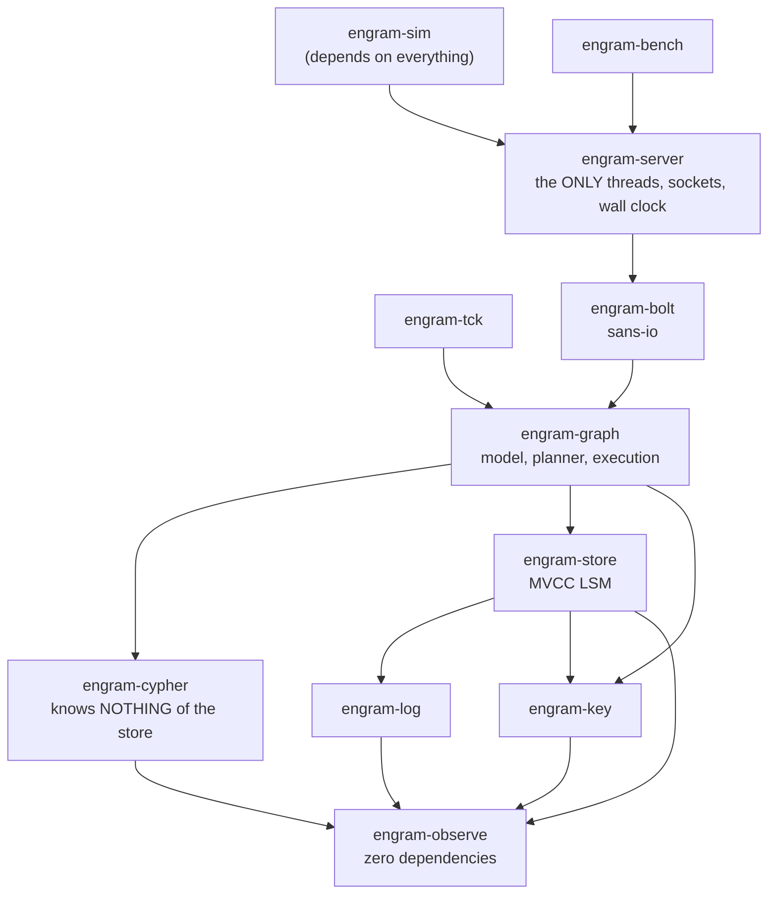

# Crate map and dependency rules

Sixteen crates plus `xtask`, in a strictly acyclic graph with
`engram-observe` — which has no dependencies of its own — at the root.

The boundaries are not conventions. Each is enforced by something that fails a
build.

## The graph



The four seam crates — `engram-exec`, `engram-crypto`, `engram-objstore`,
`engram-blob` — sit outside this path entirely. See [Seams](./seams.md).

`engram-runtime` is a **dev-dependency** of every engine crate; only
`engram-sim` depends on it for real. It is the simulation lane's executor, not
the serving path's.

## The rules, and what enforces each

### 1. `engram-cypher` has exactly one dependency

`engram-observe`. No store, no graph.

Graph access during evaluation happens through a **`GraphHooks` trait** that
`engram-graph` implements. That is what lets the parser, the value model and the
TCK harness be tested without a store existing.

*Enforced by:* the dependency graph. Adding `engram-store` to that manifest is
the whole violation.

### 2. `engram-bolt` is sans-io

```rust
pub fn feed(&mut self, bytes: &[u8]) -> Result<Vec<u8>, WireError>
```

It never touches a socket. `engram-server` is the adapter.

*Enforced by:* the dependency graph, and by the protocol tests driving `feed`
with byte arrays.

### 3. The engine never spawns a thread

`clippy.toml` denies `std::thread::spawn` and `std::thread::sleep`
workspace-wide. `engram-server` is the only crate that opts out.

Parallelism re-enters through the `ScopedExec` seam, whose only production
implementor is the server.

*Enforced by:* `disallowed-methods = "deny"`, and `cargo xtask determinism` for
what the lint cannot see.

### 4. Time is injected

`clippy.toml` denies `Instant::now` and `SystemTime::now`. The adapter calls
`graph.set_wall_ms(now)` immediately before feeding bytes; anything needing
ordering uses the store's commit counter.

*Enforced by:* the lints, then the determinism gate — two processes, one seed,
one identical trace digest.

### 5. Iteration order is deterministic

`HashMap` and `HashSet` are denied types: `BTreeMap` where order matters,
`IndexMap` where insertion order is what you mean.

*Enforced by:* `disallowed-types = "deny"`, and again the determinism gate,
because iteration order rots invisibly.

### 6. The keyspace is the gate, not the planner

`Kind::is_protected` is a **range check**, and `Store::put` refuses a plaintext
write to any protected KIND — including ones this build has never seen. A user
property value cannot become a key component, because `Structural` is a **sealed
trait**.

*Enforced by:* the type system, plus `cargo xtask hygiene`, which compiles a
violating program and requires the build to fail *for the seal's reason*, then a
legitimate one and requires it to pass. One direction alone would certify the
rule on the strength of an unrelated build error.

### 7. Every subsystem registers

Twelve `Subsystem` implementations declare crash points, `sometimes!` events,
counters and gate/canary pairs.

*Enforced by:* `cargo xtask d3` — which reports how many files it scanned and
how many implementations it checked, because a gate that walked zero files
prints "no findings" in the same words as one that walked all of them.

### 8. A native dependency needs at most one `cc` invocation

No cmake, no bindgen, no external shared library, no build-time process.

*Enforced by:* `cargo xtask c-deps`, which keys on `links` and build-script
presence rather than on a `-sys` or `cc` **name** match — `ring` and `crc-fast`
match neither pattern, so a name-based gate would pass them both while claiming
to have checked.

## Why the layering is shaped this way

Reading bottom-up, each layer exists so the one above can be tested without the
one below:

| crate | testable without |
|---|---|
| `engram-observe` | anything |
| `engram-key` | a store |
| `engram-log` | a store |
| `engram-cypher` | a store or a graph |
| `engram-bolt` | a socket |
| `engram-graph` | a network |
| `engram-server` | — it is the adapter |

That is why `engram-graph` has 196 integration test files and no network in any
of them.

## The two crates that are not published

`engram-tck` (`publish = false`) vendors the openCypher TCK, which is Apache-2.0
and copyright Neo4j Sweden AB, redistributed under its own terms.

`engram-bench` (`publish = false`) holds nineteen harness binaries.

## Where the size is

`engram-graph` is **52% of the engine's source lines and 71% of its test
files** — the centre of gravity by a wide margin. `interp.rs`, `pipeline.rs`
and `lib.rs` are each over 10,000 lines.

Worth knowing before you go looking: if it concerns the graph model, the planner
or execution, it is almost certainly in one of those three.

## Next

- [Architecture overview](./overview.md) — what each crate does.
- [The three decisions](./three-decisions.md) — where the rules come from.
- [The gates](../development/gates.md) — running the enforcement.
