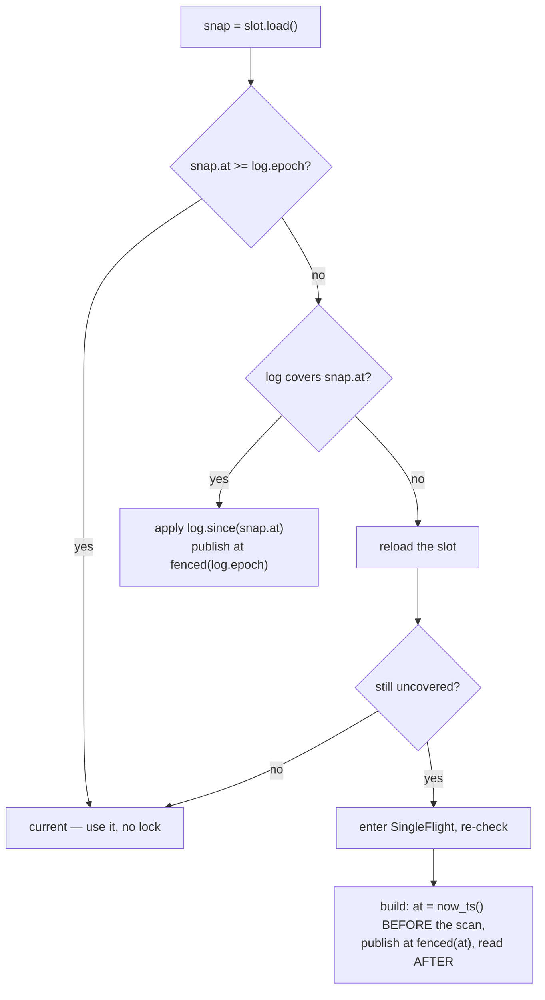

# Derived structures

A graph keeps many structures **derived** from its store: label memberships,
range indexes, adjacency tables, degree tables, BFS memos. Each is a cache of
some source — a label's membership rows, a property's values, one relationship
type's adjacency rows — and is correct exactly as long as that source has not
changed since it was built.

This is the most consequential design in the engine, both for performance and
for the one operational surprise Engram has. It is also the page to read if
first-query latency or write throughput ever puzzles you.

## Why there is one rule

Six times in one day, the same defect was found in six different caches:

1. **Validity keyed on the wrong clock.** A cache compared its build clock to
   the store's *global* commit clock, which every write advances — so a write to
   an unrelated structure invalidated it. A `SET n.hits` rebuilt a label
   membership; a `CREATE (:Message)` reset the adjacency probe gate so every
   traversal, over relationship types the write never touched, bypassed a
   current table for its first 1,024 hops.
2. **Catch-up by copy.** Applying a delta of five ids copied the whole label —
   O(label) per read after a write.
3. **Deltas consumed by the first reader.** The first stale reader took the
   delta; a concurrent reader on another worker found none and fell to a full
   rebuild under the store's read lock, stalling every writer. Worse, a rebuild
   at an older epoch could be published over a newer catch-up and **lose a
   row** — a correctness fault, and reachable.

Each was fixed as a special case, and the next cache had it again. So the fixes
were replaced by one mechanism.

## The rule

A derived structure is four things:

**A `ChangeLog` of its source.** Append-only, stamped with the commit timestamp
of each change, carrying the source's own epoch. Readers apply entries newer
than their snapshot and **never consume** them — two concurrent readers apply
the same entries and publish the same result. Entries are pruned only behind a
*published* snapshot, so nothing a live snapshot needs is dropped.

A change that cannot be expressed as an entry — an overflow, a write inside a
transaction — is a **`touch`**, which raises the floor and forces a rebuild for
anything older. The conservative direction, and the only one.

**A `Slot`** holding the current snapshot, published **monotonically**: an
older-epoch build can never overwrite a newer one.

**A `SingleFlight`** guard around the *build* path only, one per slot, so N
workers missing at once do one rebuild rather than N — and a build of one
structure never holds up a builder of another.

**An O(delta) snapshot** — a shared immutable base plus a small overlay, folded
into a new base on a threshold. Not O(base).

## The reader protocol

Three details carry the correctness:

**The epoch a catch-up is stamped with is read under the log's lock**, in the
same critical section as the entries. Reading the clock separately is the
stale-stamp hazard: a reader that took `now_ts()` after a write's rows committed
but before the write *logged* them would stamp its snapshot as newer than a
change it does not contain — and then be judged current for ever.

**A build's stamp is `now_ts()` read *before* the scan**, so every change at or
below it has rows the scan sees, and clamped *after*.

**The loser's re-check behind `SingleFlight` has three arms, not two**, because
the winner's publish is clamped below the epoch whenever any writer was in
flight. Two arms would misjudge a correct snapshot as stale.

## The write fence

A publish is clamped below every in-flight writer. Without that clamp, a
snapshot could be stamped above a commit whose rows it has not seen — the same
hazard as above, arriving from the writer's side.

The fence has a counter (`fenced`) and the hammer test asserts it actually
fired, because a fence that never clamps anything is not demonstrated by a
green test.

## What is derived

| structure | source | what it serves |
|---|---|---|
| **Adjacency tables** (CSR) | the `'O'`/`'I'` half-edge rows | every traversal |
| **Membership views** | the `'L'` rows | `MATCH (n:Label)` and label filters |
| **Degree tables** | adjacency | `count` over neighbours |
| **Range indexes** | property values | anchored lookups |
| **Hop-count memos** | adjacency | cardinality estimates |
| **BFS memos** | adjacency | repeated shortest-path work |

### Adjacency tables

A CSR base — a sorted contiguous array of neighbours with a row directory —
plus a `BTreeMap` overlay for repairs.

The row directory is **sparse**, and that was a fix: a dense one costs O(ids)
*per table*, and there is a table per `(type, direction)`. On one corpus with
159 relationship types and ~3.4M ids named, that was **4.36 GB of offsets
carrying 540 MB of entries**.

`slice` is the hottest read in the engine, and it pays a `BTreeMap` descent per
hop while an overlay is present — hence `--adj-overlay-fold` (4,096) governing
when a repair folds into a new base.

### Membership views

An immutable base plus added/removed overlays, with an optional presence bitmap
past `--members-bitmap-after` probes and a materialised flat form on demand.

## The operational consequence

**This is the one surprise Engram has, and it is worth understanding before you
meet it.**

Every structure catches up on the first read that needs it, and its change log
is pruned only behind that publish. So **a write burst with no reader between
hands its whole changed set to one unlucky reader.** That was measured as a
**25-second stall** on the twelfth read after two write-only phases.

Two mechanisms address it:

**Warm at startup.** Structures are built before the listener accepts, so the
first query after a restart does not pay for the corpus. Deferring that measured
5.85 s on a 1.48M-node graph.

**Reader-independent refresh.** The maintenance thread runs
`refresh_stale_derived` after `--refresh-after-writes` commit stamps (8,192) and
on every tick (5 s), so readers find current structures.

### The refresh is a trade, and it was measured

Turning the refresh on removed the 25-second stall — one contention profile went
from **1 to 373 ops/s**. It also cost a **2–3× write tax** on a write-only
burst.

That is why `--no-derived-refresh` exists: on a write-only workload where
nothing reads until later, moving the cost back to the reader is cheaper. It is
an A/B arm with a real trade behind it, not a bug switch.

## Repair, and the choices a reader makes

A reader whose table is stale has options, and each is a flag:

| situation | default behaviour | the arm |
|---|---|---|
| the table is stale as a whole | ask whether *this node* moved | `--no-lazy-stale-serve` |
| answering that question | one atomic load | `--no-adj-change-filter` |
| this node did move | walk its own span, O(degree) | `--no-single-node-stale-walk` |
| several readers miss at once | each repairs | `--single-flight-repair` |

That last one is instructive: queueing readers on the build guard so a stale
table is repaired once **sounds** better and measured **40% slower**. It ships as
the control, not as a setting.

Rebuilds are also **demoted**: a stale table waits for a compaction rather than
having a reader rebuild it, because in paged mode compaction emits the CSRs
anyway.

## Nothing is authoritative but the rows

Every structure here can be discarded and rebuilt from the store. Sidecars that
persist them are caches of caches — a missing or stale one costs time, not
correctness.

That is what makes the whole design safe to be aggressive about: the worst case
is slow, never wrong.

## Next

- [Paged mode](./paged-mode.md) — where compaction emits these.
- [Indexes](./indexes.md) — the index-shaped ones.
- [Tuning guide](../reference/tuning.md) — "my writes stall periodically".
- [Compiled-in constants](../reference/constants.md) — every threshold here.
