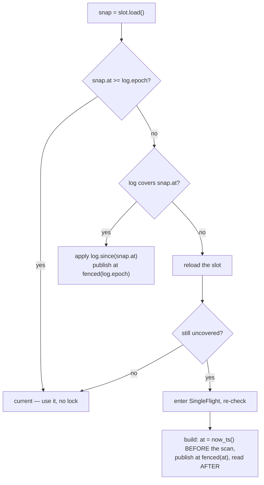

# Derived structures

A graph keeps many structures **derived** from its store: label memberships,
range indexes, adjacency tables, degree tables, BFS memos. Each is a cache of
some source — a label's membership rows, a property's values, one relationship
type's adjacency rows — and is correct exactly as long as that source has not
changed since it was built.

This is the most consequential design in the engine, both for performance and
for the one operational surprise Engram has. It is also the page to read if
first-query latency or write throughput ever puzzles you.

## Why there is one rule

Six times in one day, the same defect was found in six different caches:

1. **Validity keyed on the wrong clock.** A cache compared its build clock to
   the store's *global* commit clock, which every write advances — so a write to
   an unrelated structure invalidated it. A `SET n.hits` rebuilt a label
   membership; a `CREATE (:Message)` reset the adjacency probe gate so every
   traversal, over relationship types the write never touched, bypassed a
   current table for its first 1,024 hops.
2. **Catch-up by copy.** Applying a delta of five ids copied the whole label —
   O(label) per read after a write.
3. **Deltas consumed by the first reader.** The first stale reader took the
   delta; a concurrent reader on another worker found none and fell to a full
   rebuild under the store's read lock, stalling every writer. Worse, a rebuild
   at an older epoch could be published over a newer catch-up and **lose a
   row** — a correctness fault, and reachable.

Each was fixed as a special case, and the next cache had it again. So the fixes
were replaced by one mechanism.

## The rule

A derived structure is four things:

**A `ChangeLog` of its source.** Append-only, stamped with the commit timestamp
of each change, carrying the source's own epoch. Readers apply entries newer
than their snapshot and **never consume** them — two concurrent readers apply
the same entries and publish the same result. Entries are pruned only behind a
*published* snapshot, so nothing a live snapshot needs is dropped.

Past its cap a log drops the **oldest half** and raises the floor only to the
last dropped stamp, so a snapshot stamped inside the kept half still catches up
and one below it rebuilds. Nothing is dropped silently: `covers` refuses a
snapshot below the floor rather than handing it a delta with a hole. A log can
also be *widened* — a consumer that would rebuild from N records asks for a cap
proportional to N, between 16,384 (`PROP_LOG_CAP`) and 524,288
(`PROP_LOG_CAP_MAX`) entries — because a log is worth keeping while it is
cheaper than the rebuild it prevents.

The whole-log clear survives in one place, and it is not the overflow: a change
stamped at or below the floor is a change some published snapshot was already
stamped past. The write fence makes that impossible, so when it happens the log
**fails closed** — every entry is dropped, the floor rises to the epoch, the
event is counted, and the caller retracts the snapshot at the epoch itself.

A commit needs none of this. `Graph::commit_owned` replays its own touched set
into the logs as entries, exactly as the direct path does ([the write
path](./write-path.md) describes the replay). That is what stopped every insert
making every reader rebuild — which is what happened when every statement was a
transaction and a commit merely *touched* each source it changed.

**A `Slot`** holding the current snapshot, published **monotonically**: an
older-epoch build can never overwrite a newer one.

There is one same-stamp replacement, and it is a separate operation for a
stated reason. A **fold in place** swaps a snapshot's *layout* without changing
its rows, and it compare-and-swaps on the snapshot's **identity** rather than on
its stamp — a retract followed by a rebuild puts a different table at the same
stamp, and a swap on the stamp alone would reinstate the rows the retract threw
away. The maintenance pass is the only caller: it folds a table that is current
but still carrying a reader's repair overlay. No reader performs one, which is
why it does not appear in the protocol below.

**A `SingleFlight`** guard around the *build* path only, one per slot, so N
workers missing at once do one rebuild rather than N — and a build of one
structure never holds up a builder of another.

**An O(delta) snapshot** — a shared immutable base plus a small overlay, folded
into a new base on a threshold. Not O(base).

## The reader protocol

```mermaid
flowchart TD
    A["snap = slot.load()"] --> B{"snap.at >= log.epoch?"}
    B -->|yes| C["current — use it, no lock"]
    B -->|no| D{"log covers snap.at?"}
    D -->|yes| E["apply log.since(snap.at)<br/>publish at fenced(log.epoch)"]
    D -->|no| F["reload the slot"]
    F --> G{"still uncovered?"}
    G -->|no| C
    G -->|yes| H["enter SingleFlight, re-check"]
    H --> I["build: at = now_ts() BEFORE the scan,<br/>publish at fenced(at), read AFTER"]
```

Three details carry the correctness:

**The epoch a catch-up is stamped with is read under the log's lock**, in the
same critical section as the entries. Reading the clock separately is the
stale-stamp hazard: a reader that took `now_ts()` after a write's rows committed
but before the write *logged* them would stamp its snapshot as newer than a
change it does not contain — and then be judged current for ever.

**A build's stamp is `now_ts()` read *before* the scan**, so every change at or
below it has rows the scan sees, and clamped *after*.

**The loser's re-check behind `SingleFlight` has three arms, not two**, because
the winner's publish is clamped below the epoch whenever any writer was in
flight. Two arms would misjudge a correct snapshot as stale.

## The write fence

A publish is clamped below every in-flight writer. Without that clamp, a
snapshot could be stamped above a commit whose rows it has not seen — the same
hazard as above, arriving from the writer's side.

The fence has a counter (`fenced`) and the hammer test asserts it actually
fired, because a fence that never clamps anything is not demonstrated by a
green test.

## What is derived

| structure | source | what it serves |
|---|---|---|
| **Adjacency tables** (CSR) | the `'O'`/`'I'` half-edge rows | every traversal |
| **Membership views** | the `'L'` rows | `MATCH (n:Label)` and label filters |
| **Degree tables** | adjacency | `count` over neighbours |
| **Range indexes** | property values | anchored lookups |
| **Hop-count memos** | adjacency | cardinality estimates |
| **BFS memos** | adjacency | repeated shortest-path work |
| **Property columns** | a label's members' values for one property | vectorised property reads and predicates |
| **Trigram indexes** | one label, one string property | `=~`, `CONTAINS`, `ENDS WITH` |
| **Term indexes** (BM25) | tokenised text per field | `db.index.fulltext.queryNodes` |

### Adjacency tables

A CSR base — a sorted contiguous array of neighbours with a row directory —
plus a `BTreeMap` overlay for repairs.

The row directory is **sparse**, and that was a fix: a dense one costs O(ids)
*per table*, and there is a table per `(type, direction)` — so across many
relationship types the offsets grow with types × ids while the entries grow only
with the relationships, and the directories can outweigh what they index many
times over.

`slice` is the hottest read in the engine, and it pays a `BTreeMap` descent per
hop while an overlay is present — hence `--adj-overlay-fold` (4,096) governing
when a repair folds into a new base.

### Membership views

An immutable base plus added/removed overlays, with an optional presence bitmap
past `--members-bitmap-after` probes and a materialised flat form on demand.

### Property columns

The sorted `(id, value)` entries of one property over one label's members — or
just the sorted ids carrying it — kept between statements so a vectorised read
or predicate does not re-gather them.

This is the one structure here that is **not** a `Slot`. It is a byte-budgeted
cache: `PROP_COLUMN_BUDGET_BYTES` (512 MiB) with least-recently-used eviction,
because a column is worth what it saves and there is no bound on how many
`(label, property)` pairs a workload touches.

Its currency test is the one the rest of the page describes, arrived at late. A
column records the **label epoch and the property epoch** it was read at, and is
current while neither has moved. Before that it recorded only the commit clock,
which every write anywhere advances — so a read-heavy mix retired
`(Person, firstName)` on writes that created Messages and touched neither.

The commit clock survives as the fallback for a property that has **no change
log**, since `prop_epoch` is then fixed at 0 and keying on it would mean never
invalidating. Narrowing that fallback is what `--prop-column-restamp` does, and
it ships **off**: its soundness rests on every path that can invalidate a column
having accounted for itself, and the direct write path records into an existing
log only. Under the plain clock that gap is harmless; under a re-stamp a commit
touching some other property would revive a column the direct write had already
replaced.

### Trigram and term indexes

Both are slot caches like the range indexes, and both hold far fewer slots,
because each slot is far larger. Trigram indexes hold `TRIGRAM_CACHE_MAX` = 16,
one per `(label, property)`, against the range cache's 256 — a trigram index
carries one entry per three-character window of every value. Term indexes hold
`TERM_CACHE_MAX` = 8, since one also carries per-document lengths and corpus
totals beside its postings; they are keyed by fulltext **index name** rather
than by column, because a fulltext index spans labels times properties — the
unit is the index, not the column.
Neither is persisted, and both are built lazily, on the first probe that needs
one, behind the same `SingleFlight` guard everything else here uses.

## The operational consequence

**This is the one surprise Engram has, and it is worth understanding before you
meet it.**

Every structure catches up on the first read that needs it, and its change log
is pruned only behind that publish. So **a write burst with no reader between
would hand its whole changed set to one unlucky reader**, which then stalls for
as long as the catch-up takes.

Four things address it. Two are reader-side:

**Warm at startup.** Structures are built before the listener accepts, so the
first query after a restart does not pay for the corpus. A paged server first
**adopts** the derived sidecar — before warming, because the warm builds every
structure a sidecar would have supplied — and the warm then keeps every adopted
adjacency direction that is current and builds only what is missing. See
[Paged mode](./paged-mode.md#sidecars).

**Reader-independent refresh.** The derived-refresh thread runs
`refresh_stale_derived` after `--refresh-after-writes` commit stamps (8,192) and
on every tick (5 s), so readers find current structures.

And two are about what the pass and the logs do under that load:

**The pass is bounded and budgeted**, rather than taking one repair as far as it
goes — the next section.

**A change log survives its own overflow.** It drops the oldest half rather than
everything, and can be widened in proportion to the index it protects, so an
idle index under a write stream catches up where it used to rebuild.

The shape is unchanged — that is why it is still on this page. What these
change is the size of the bill: the refresh keeps the backlog any one reader can
inherit small, and the budget and the overflow rule keep the pass itself from
becoming the stall.

A graceful stop of a paged server adds one more step. `CALL engram.checkpoint()`
**drains** before it reports: it seals, spills and checkpoints the WAL, brings
every derived structure current by running the refresh to a fixed point (at
most 64 passes), warms whatever the pass could not repair, and persists the
derived sidecar, so the next start adopts what this process built instead of
rebuilding it. The derived part of the drain runs only while the resident set is
at or below half the memory ceiling (`--memory-max-mb`): it rebuilds stale
structures while the old ones are still published, so it needs room, and above
that line the checkpoint says so and the next start rebuilds — slower, not dead.
[Paged mode](./paged-mode.md#the-checkpoint-drain) has the steps.

### The refresh is a trade

Turning the refresh on moves the catch-up off the reader. It is not free for the
writers: every commit takes the write side of the change-log lock it records
into, and the pass reads those same logs.

The pass therefore holds a log's read side only to **copy** what the stamp rule
needs in one critical section — the entries since the table's epoch, and the
fence — and does everything else after releasing it: `adj_repair_change_set`
builds the node set, prices it and cuts it to the budget outside the adjacency
log's lock, and `members_caught_up` folds a label's membership outside the label
log's. Before, the pass computed under the read side — and on Linux a writer
queued on a held lock also queues every reader behind it.

`--no-derived-refresh` still exists: on a write-only workload where nothing
reads until later, moving the cost back to the reader is cheaper. It is an A/B
arm with a real trade behind it, not a bug switch. It is also the blunt lever,
and rarely the one you want.

### The pass has a row budget, and shares it

`--refresh-pass-rows` (250,000 rows; `0` is unbounded) bounds how much one pass
re-reads. The budget is shared **max-min**, cheapest table first: each stale
table takes the smaller of its own cost and an even share of what is left. That
is the difference between a lopsided stale set giving its backlogged table the
remainder and giving it one nth of the pool — first-come-first-served over a
stable iteration order starves the same tables every pass.

A table the budget defers is **delayed, never dropped**: it is still stale on
the next tick, and a repair publishes at the last stamp it holds in full rather
than at a stamp it does not.

Five levers govern the pass, all on by default, and each is an A/B arm rather
than a setting — [the CLI reference](../reference/cli.md) documents each:

| situation | default behaviour | the arm |
|---|---|---|
| several tables are stale at once | bound each repair to its slice and share the budget max-min | `--no-bounded-derived-repair` |
| a membership catch-up the log covers | exempt from the budget — it re-reads no rows | `--no-unmetered-members-catch-up` |
| pricing a repair | read the logs' lengths, O(log n) | `--no-cheap-repair-pricing` |
| a reader's repair left a big overlay | the maintenance thread folds it, not the reader | `--no-deferred-reader-fold` |
| where the pass runs | its own thread | `--no-split-maintenance` |

The deferred fold has a ceiling of its own: past `ADJ_DEFERRED_FOLD_CEILING`
(16) multiples of `--adj-overlay-fold`, the reader folds after all. A pass is
not guaranteed to run — `--no-derived-refresh` and a bare `Graph` run none, and
a table that goes quiet after a burst is current and never repaired again — so
without the ceiling the overlay grew toward the table's node count in exactly
those regimes.

## Repair, and the choices a reader makes

A reader whose table is stale has options, and each is a flag:

| situation | default behaviour | the arm |
|---|---|---|
| the table is stale as a whole | ask whether *this node* moved | `--no-lazy-stale-serve` |
| answering that question | one atomic load | `--no-adj-change-filter` |
| this node did move | walk its own span, O(degree) | `--no-single-node-stale-walk` |
| several readers miss at once | each repairs | `--single-flight-repair` |

That last one is instructive: queueing readers on the build guard so a stale
table is repaired once **sounds** better, and removes most of the duplicated
work — but the readers that used to duplicate it in parallel then queue on one
mutex, and the repair sits on the critical path of every read. The redundancy
was never the cost. It ships as the control, not as a setting.

Rebuilds are also **demoted**: a stale table waits for a compaction rather than
having a reader rebuild it, because in paged mode compaction emits the CSRs
anyway.

## Nothing is authoritative but the rows

Every structure here can be discarded and rebuilt from the store. Sidecars that
persist them are caches of caches — a missing or stale one costs time, not
correctness. Within a process only one derived-sidecar persist or adoption runs
at a time, so a file is never truncated under its writer or replaced by a
partial one mid-adoption; [Paged mode](./paged-mode.md#sidecars) has the
lifecycle.

That is what makes the whole design safe to be aggressive about: the worst case
is slow, never wrong.

## Next

- [Paged mode](./paged-mode.md) — where compaction emits these.
- [Indexes](./indexes.md) — the index-shaped ones.
- [Tuning guide](../reference/tuning.md) — "my writes stall periodically".
- [Compiled-in constants](../reference/constants.md) — every threshold here.
