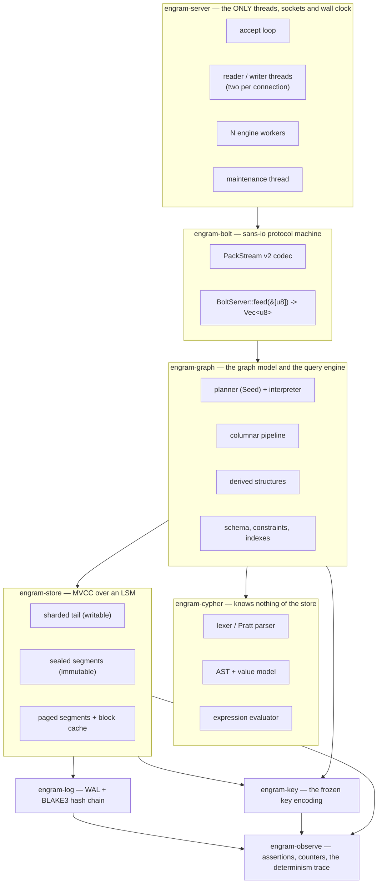
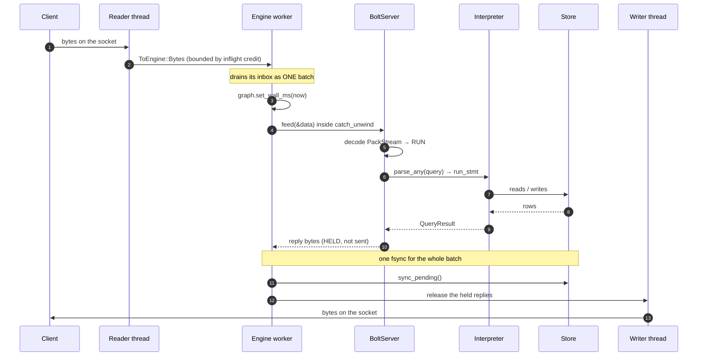
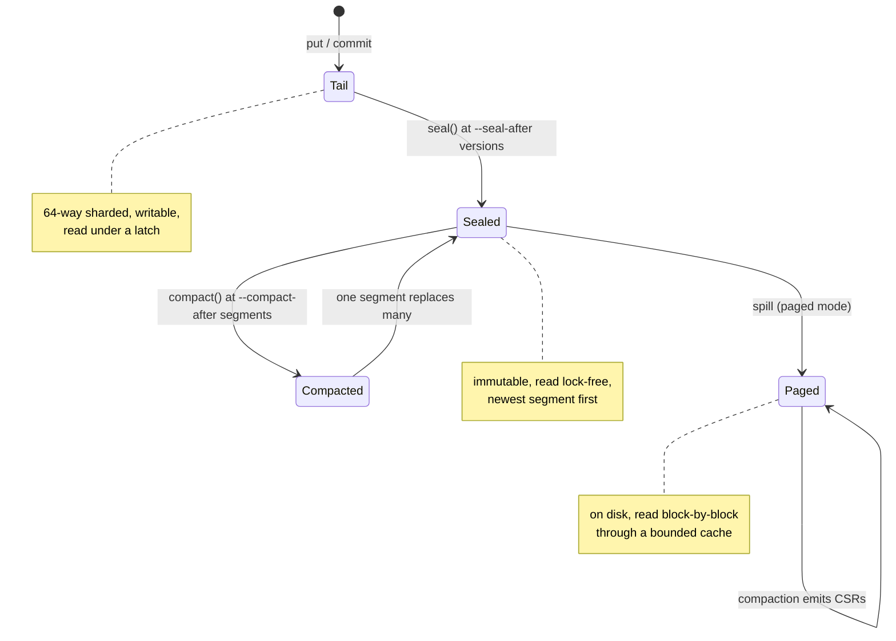

# Architecture overview

Engram is one process serving one shard — though not one thread: `--workers N`
engine threads share the store, and a statement can split its work across
morsels. A Bolt connection arrives on a socket, its bytes become a Cypher
statement, the statement runs against an MVCC store, and the rows come back out
the same socket. This page is the map of that path
and of the crates it runs through.

If you are reading the source for the first time, read this and then
[The three decisions](./three-decisions.md), which explains why the code is
shaped the way it is.

## The layers

Arrows point the way dependencies point. `engram-observe` is at the bottom with
no dependencies of its own; everything can assert.

## Crates

| crate | responsibility |
|---|---|
| `engram-observe` | The assertion vocabulary — `always!`, `sometimes!`, `counted!`, crash points, the determinism trace. Zero dependencies; the root of the graph. |
| `engram-runtime` | The `Runtime` trait (time, randomness, spawning, I/O), a real simulated executor with a virtual clock, and an optional Tokio one. **A dev-dependency of every engine crate** — only `engram-sim` depends on it for real, so it is the simulation lane's executor rather than the serving path's. |
| `engram-key` | The frozen memcomparable key encoding, the KIND registry, and the sealed `Structural` trait that makes the keyspace hygiene rule unrepresentable to break. |
| `engram-log` | The commit log and write-ahead log: plaintext routing headers, opaque payloads, and a BLAKE3 hash chain. |
| `engram-store` | MVCC storage: a 64-way sharded memtable, immutable sealed segments, the on-disk SST format, a block cache, range and vector indexes, adjacency posting lists. |
| `engram-cypher` | The front end: lexer, Pratt expression parser, statement AST, the value model with three-valued logic, temporal types, and the evaluator. Depends only on `engram-observe`. |
| `engram-graph` | The graph model over the store, the planner, the columnar `DataChunk` pipeline with its morsel-parallel operators, the row-at-a-time interpreter underneath it as the general fallback, derived structures, schema and constraints. The largest crate by far. |
| `engram-bolt` | A sans-io Bolt v5 state machine and the PackStream v2 codec. Never touches a socket. |
| `engram-server` | The TCP adapter. The only crate with threads, sockets and a wall clock — and the only one that opts out of the determinism lints. |
| `engram-sim` | The deterministic simulation harness: one seed, one run, swarm-configured, ending in invariant checks and a coverage floor. |
| `engram-tck` | The vendored openCypher TCK and its runner. Not published. |
| `engram-bench` | Nineteen benchmark and loader binaries. Not published. |
| `engram-exec`, `engram-crypto`, `engram-objstore`, `engram-blob` | Seams that are built and simulated but not on the serving path — see [below](#the-seams). |
| `xtask` | The gates: `d3`, `c-deps`, `msrv`, `determinism`, `hygiene`, `docs`, `scrub`, `public-tree`. |

[Crate map and dependency rules](./crate-map.md) has the boundary rules and why
each is enforced mechanically.

## A query, end to end

Two details in that diagram do real work:

- **The reply is held.** A worker collects every reply its batch produced,
  pays **one** `fsync`, and only then releases them. That is group commit: with
  one client it degrades to one fsync per write and costs nothing; with eight,
  the fsync is long enough that all eight share it.
- **The wall clock is injected at exactly one point.** `set_wall_ms` immediately
  before `feed` is the only place a real clock enters the engine. Everything
  below reads time from what it was handed, which is what makes a seeded
  simulation reproduce a run exactly.

## Where the data lives

A read walks the tail (if it is non-empty) and then the sealed segments,
newest-first, stopping at the first version visible at its snapshot. Sealing
moves the *entire* tail — there is no partial seal, because a partial one would
have to split a version chain across two places.

[The storage engine](./storage-engine.md) and [Paged mode](./paged-mode.md)
carry the detail.

## Threads

There are exactly six kinds, and all of them live in `engram-server`:

| thread | count | what it does |
|---|---|---|
| accept loop | 1 (the main thread) | accepts connections, enforces the cap, pins each to a worker by `id % workers` |
| reader | 1 per connection | socket → engine, with a credit loop for backpressure |
| writer | 1 per connection | engine → socket |
| engine worker | `--workers`, default 1 | owns its sessions; batches, runs, fsyncs once, replies |
| maintenance | 1 | compaction, spilling, log truncation, derived-structure refresh |
| counters | 1 | prints the counter and memory lines every 30s, only when something moved |

The engine below `engram-server` **never spawns a thread** — `std::thread::spawn`
is denied workspace-wide, and the server is the only crate that opts out. That
is not the same as being single-threaded: `--workers N` runs N engine threads
over a store that is `Send + Sync`, with MVCC and optimistic concurrency control
keeping them honest. What the rule buys is that every thread in the process is
created in one file, and parallelism inside a statement re-enters through one
explicit seam (`ScopedExec`) that is absent by default.

[Concurrency and the worker model](./concurrency.md) has the rest.

## The seams

Four crates are compiled, tested and simulated, but nothing on the Bolt path
calls them: `engram-crypto` (per-tenant keys, AEAD sealing), `engram-objstore`
(the object-storage seam), `engram-blob` (large-media referencing), and
`engram-exec` (the bitmap operator seam).

They exist because the decisions they encode cannot be retrofitted — a hash
chain added later cannot attest to history that predates it, and a key
derivation added later cannot shred data already written. Their presence is not
a shipped feature, and
[Seams not yet on the serving path](./seams.md) says so at length.

## Where to go from here

| you want | read |
|---|---|
| why the code looks like this | [The three decisions](./three-decisions.md) |
| what depends on what, and why it is enforced | [Crate map and dependency rules](./crate-map.md) |
| the read path in detail | [The query path](./query-path.md), then [The planner](./planner.md) |
| the write path in detail | [The write path](./write-path.md) |
| how rows are stored | [The storage engine](./storage-engine.md), [Key encoding](./key-encoding.md) |
| why the first query after a burst can be slow | [Derived structures](./derived-structures.md) |
