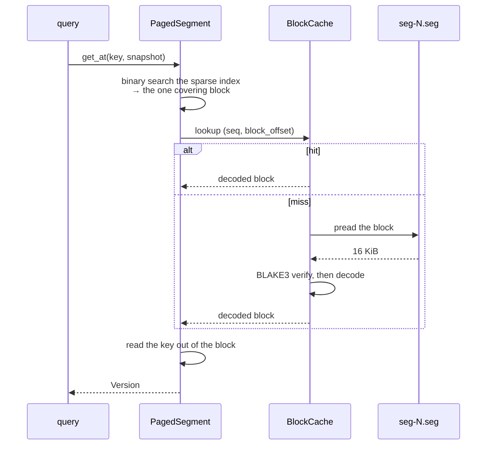

# Paged mode

Paged mode serves a graph **larger than memory**. Sealed segments spill to disk
and are read block-by-block through a bounded cache, so the **working set**
rather than the corpus sets the memory floor.

```sh
engram-server 127.0.0.1:7687 --paged-dir ./paged --paged-cache-mb 8192
```

> **It is not the durable mode.** Durability is at seal boundaries only, and a
> crash loses the unsealed tail. [Durability and recovery](../using/durability.md)
> demonstrates that loss rather than describing it. `--paged-dir` and
> `--data-dir` are mutually exclusive and the server exits rather than guess.

## What a paged segment keeps resident

Almost nothing:

- the **footer**, and
- a **sparse first-key index** — one key per block.

Everything else is resolved on demand.



A point read is therefore: one binary search, one cache lookup, and — on a miss
— one `pread` of 16 KiB plus a hash check.

## The block is the unit of everything

`TARGET_BLOCK_BYTES` is **16 KiB**, and that one number is the granularity of
caching, reading and integrity.

**A corrupt block fails BLAKE3 at the exact `pread` that needs it** — never a
silent wrong answer. Verification is not a background scrub you have to
remember to run; it is on the read path, and it costs a hash over 16 KiB.

## The block cache

Bounded by `--paged-cache-mb` (default 4096). **8 shards**, keyed
`(seq, block_offset)`.

**Admission is S3-FIFO-lite and scan-resistant**: a small probation queue — 10%
of each shard's budget — sits in front of a main queue, so a one-shot scan
cannot evict the hot working set. A full-table scan through a full cache
bypasses it and evicts nothing.

**Eviction is drop-the-frame.** Sealed blocks are clean by construction — they
are never dirty, because segments are immutable — so there is no writeback and
no eviction stall.

The cache handle is created once by `Store::open_paged_dir` and **shared by
every later spill**. A cache per spill would grow the memory bound with uptime,
which is why `ServerConfig::paged_spill_cache` insists on the same handle rather
than accepting a fresh one.

## Spilling

Sealed segments are written to `seg-<seq>.seg`, ordered by sequence. That
ordering is load-bearing: a durable reopen orders segments by sequence, so a
compaction taking a lower sequence than a seal that landed after it would let
the older run shadow the newer one.

Spilling happens on the maintenance thread, and on a `CALL engram.checkpoint()`.

## Paged compaction emits the derived structures

This is the part worth knowing, because it changes how you tune.

A paged compaction merges segments — and the merge **walks every adjacency and
membership row in key order anyway, and that order *is* the CSR**. So the
compaction **emits the adjacency CSRs and membership bases** rather than leaving
them to a separate full rescan.

Two consequences:

- Compaction is not purely a storage-maintenance operation; it is also how
  derived structures refresh in paged mode.
- **`--compact-every S`** puts a *time* floor under compaction, which therefore
  puts a floor under how often those structures refresh — one that does not
  depend on write volume. On a low-write, high-read workload that is the flag
  that matters.

## Sidecars

Two kinds of file sit beside the segments:

- **Index sidecars** — declared range indexes, written on a quiescent tick, so
  a restart adopts them rather than rebuilding.
- **The derived sidecar** — adjacency and membership bases, adopted at startup
  by `adopt_derived_sidecar`.

Both are caches: authoritative data is always the rows, and a missing or stale
sidecar costs time, not correctness. A sidecar refused for vintage reports
itself, because "refused silently" and "never written" look identical — one v2
start found a v1 file, refused it without a word, warmed for 74 seconds, and
the only evidence was a warm time that had not improved.

Rewrites are rate-limited by a growth interval (default 600 s) so an unchanged
sealed set is not rewritten every tick. Without it, one build rewrote a 1.3 GB
file nine times in four minutes.

## Sizing the cache

Read the memory line:

```text
[engram-server] memory: cache 3812/4096 MB, adjacency 4894 MB in 318 table(s), …
rss 11204 MB, unattributed 1688 MB
```

- **`cache` at budget** is normal and expected — it is a cache.
- If `adjacency` dominates, more cache will not help; the derived structures
  are your memory, and their thresholds are the knobs.
- **`unattributed`** growing is the one to investigate.

## What paged mode costs

Honestly:

| | |
|---|---|
| **durability** | seal boundaries only; the tail is volatile |
| **point-read latency** | a cache miss is a syscall plus a hash |
| **no WAL** | so no replay, and no point-in-time anything |
| **compaction is heavier** | it also emits the derived bases |

What it buys is the ability to serve a corpus you cannot hold, from one process,
with a memory bound you choose.

## Next

- [The storage engine](./storage-engine.md) — the layer above.
- [Derived structures](./derived-structures.md) — what compaction emits.
- [Durability and recovery](../using/durability.md) — what a crash costs here.
