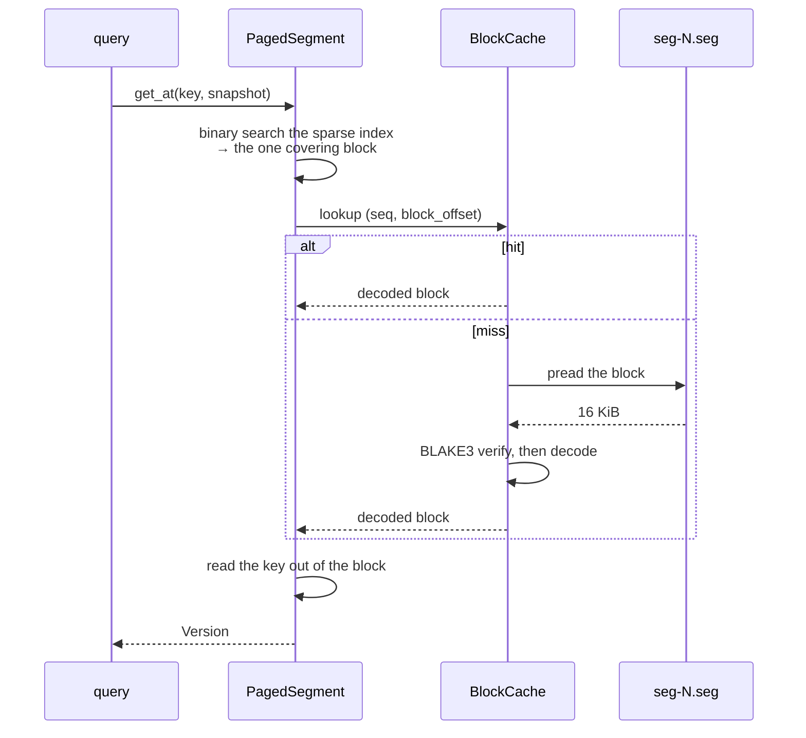

# Paged mode

Paged mode serves a graph **larger than memory**. Sealed segments spill to disk
and are read block-by-block through a bounded cache, so the **working set**
rather than the corpus sets the memory floor.

```sh
engram-server 127.0.0.1:7687 --paged-dir ./paged --paged-cache-mb 8192
```

> **Bigger than RAM, and durable.** `DIR/engram.wal` fronts the paged tail:
> every acknowledged write is appended and fsync'd before it is acknowledged,
> replayed into the tail on open, and checkpointed behind each spill. The
> guarantee is the one `--data-dir` gives — see
> [Durability and recovery](../using/durability.md). `--paged-dir` and
> `--data-dir` are still mutually exclusive, and the server exits rather than
> guess, but the reason is two on-disk *layouts*, not two durability models;
> the binary's own usage line says as much.

## What a paged segment keeps resident

Almost nothing:

- the **footer**, and
- a **sparse first-key index** — one key per block.

Everything else is resolved on demand.


```mermaid
sequenceDiagram
    participant Q as query
    participant P as PagedSegment
    participant C as BlockCache
    participant D as seg-N.seg

    Q->>P: get_at(key, snapshot)
    P->>P: binary search the sparse index<br/>→ the one covering block
    P->>C: lookup (seq, block_offset)
    alt hit
        C-->>P: decoded block
    else miss
        C->>D: pread the block
        D-->>C: 16 KiB
        C->>C: BLAKE3 verify, then decode
        C-->>P: decoded block
    end
    P->>P: read the key out of the block
    P-->>Q: Version
```

A point read is therefore: one binary search, one cache lookup, and — on a miss
— one `pread` of 16 KiB plus a hash check.

A **gather** of many keys does not pay that per key. `Store::get_many_with`
resolves a run of keys exactly as one key is resolved — tail, then sealed
segments newest first, at the visible clock — holding one block cursor per
sealed segment. A sorted id set therefore reads a block's rows in a row and
pays one cache touch (a shard lock, a map probe, an `Arc` clone) per *block*
rather than per key, which is most of the cost once the block is resident.
Unsorted keys are answered the same way, only without the reuse, and a resident
segment ignores the cursor.

## The block is the unit of everything

`TARGET_BLOCK_BYTES` is **16 KiB**, and that one number is the granularity of
caching, reading and integrity.

**A corrupt block fails BLAKE3 at the exact `pread` that needs it** — never a
silent wrong answer. Verification is not a background scrub you have to
remember to run; it is on the read path, and it costs a hash over 16 KiB.

## The block cache

Bounded by `--paged-cache-mb` (default 4096). **8 shards**, keyed
`(seq, block_offset)`.

**Admission is S3-FIFO-lite and scan-resistant**: a small probation queue — 10%
of each shard's budget — sits in front of a main queue, so a one-shot scan
cannot evict the hot working set. A full-table scan through a full cache
bypasses it and evicts nothing.

**Eviction is drop-the-frame.** Sealed blocks are clean by construction — they
are never dirty, because segments are immutable — so there is no writeback and
no eviction stall.

The cache handle is created once by `Store::open_paged_dir` and **shared by
every later spill**. A cache per spill would grow the memory bound with uptime,
which is why `ServerConfig::paged_spill_cache` insists on the same handle rather
than accepting a fresh one.

## Spilling

Sealed segments are written to `seg-<seq>.seg`, ordered by sequence. That
ordering is load-bearing: a durable reopen orders segments by sequence, so a
compaction taking a lower sequence than a seal that landed after it would let
the older run shadow the newer one.

Spilling happens on the maintenance thread, at boot before serving, and on a
`CALL engram.checkpoint()`. All three checkpoint the WAL behind the segments they
wrote.

### The checkpoint drain

`CALL engram.checkpoint()` is the call to make before a graceful stop, and it
**drains** before it reports:

1. seal whatever the tail holds;
2. spill every resident sealed segment, and checkpoint the WAL behind them, so
   the next boot replays nothing into a fresh segment;
3. run the derived-structure refresh to a fixed point (at most 64 passes), so
   nothing published is stale;
4. warm, which rebuilds exactly the adjacency directions the pass could not
   repair and keeps every current one;
5. persist the derived sidecar, named for the sealed set the next boot will
   find.

Steps 3–5 run only while the resident set is **at or below half the memory
ceiling** (`--memory-max-mb`; with no ceiling they always run). They build
fresh structures while the old ones are still published, which is exactly when
memory is short, so above the line the checkpoint logs that it skipped them and
the next start rebuilds instead — slower, not dead. The spill takes the swap
latch, so a maintenance spill or compaction already in flight is neither raced
nor waited for. The cost of not waiting: a compaction that finishes after the
persist moves the sealed set, and the next start refuses the file — correctly,
since it names segments that no longer exist — and rebuilds.

A server with no `--paged-dir` installs no checkpoint hook and refuses the
procedure, rather than answering "durable" about a store whose durability is
its WAL.

## Paged compaction emits the derived structures

This is the part worth knowing, because it changes how you tune.

A paged compaction merges segments — and the merge **walks every adjacency and
membership row in key order anyway, and that order *is* the CSR**. So the
compaction **emits the adjacency CSRs and membership bases** rather than leaving
them to a separate full rescan.

Two consequences:

- Compaction is not purely a storage-maintenance operation; it is also how
  derived structures refresh in paged mode.
- **`--compact-every S`** puts a *time* floor under compaction, which therefore
  puts a floor under how often those structures refresh — one that does not
  depend on write volume. On a low-write, high-read workload that is the flag
  that matters.

## Sidecars

Two kinds of file sit beside the segments:

- **Index sidecars** — declared range indexes, written on a quiescent tick, so
  a restart adopts them rather than rebuilding.
- **The derived sidecar** — adjacency and membership bases, adopted at startup
  by `adopt_derived_sidecar`.

Both are caches: authoritative data is always the rows, and a missing or stale
sidecar costs time, not correctness. A refused sidecar says why — present but
unreadable, of a vintage the sealed set has moved past, or describing a store
whose clock is above its stamp — because "refused silently" and "never written"
look identical, and the only evidence of a silent refusal is a warm-up that did
not get shorter.

### The derived sidecar's lifecycle

A derived sidecar's **vintage** is the sealed set it describes and how many
adjacency and membership bases it holds. Its lifecycle has four rules.

**Adopted before warming.** At start the server adopts the sidecar first and
warms second. The warm builds every structure a sidecar would have supplied, so
the other order would leave the file correct and the full build still paid. The
warm then keeps every adopted adjacency direction that is current. The whole
file is refused when the store's clock is above the sidecar's stamp: at open
there is no change log to carry the difference.

**One writer at a time.** Every persist, from the maintenance tick or from the
checkpoint drain, holds one process-wide lock from its vintage check to its
rename, so a caller that waited finds the vintage the other just recorded and
skips, and the drain never returns while another persist is part-way through
its file. A sidecar writer also claims its path, and a second writer for a path
being written is refused rather than truncating the file under the first.

**Adoption holds the same lock, and records what it adopted.** Adoption
publishes one record at a time, and the maintenance thread is already running.
A tick that fires during a slow adoption therefore waits for it, then finds the
adopted file's vintage recorded as this process's own and skips, instead of
writing the few bases published so far over the whole file. A base published
after the adoption is still written. A file with a refused record is not
recorded, so the next tick replaces it.

**Growth is paced; a stop is not.** The maintenance thread persists on a tick
whose sealed set has not moved since the last one, and skips when the vintage
is unchanged. When only the number of published bases has grown, on an
unchanged sealed set, the rewrite happens at most once per growth interval
(600 s by default), so a server whose traffic builds one base at a time does not
rewrite the whole file for each. A moved sealed set is never paced, since the
file on disk then names segments the store no longer has. The checkpoint
drain persists through `persist_derived_at_stop`, which skips only the pacing:
a stop is one explicit request whose purpose is that the next start adopts what
this process built, and deferring it would drop those bases for good. An
unchanged vintage still skips, and a stale base still declines.

## Sizing the cache

Read the memory line, printed when any of its byte terms moves by more than
64 MiB:

```text
[engram-server] t=<ms> memory: cache <resident>/<budget> MB, adjacency <MB> MB in <n> table(s),
memberships <MB> MB in <n> label(s), range indexes <MB> MB in <n> index(es),
property columns <MB> MB in <n> column(s); rss <MB> MB, unattributed <MB> MB
```

(one line in the log; wrapped here.)

- **`cache` at budget** is normal and expected — it is a cache.
- If `adjacency` dominates, more cache will not help; the derived structures
  are your memory, and their thresholds are the knobs.
- **`unattributed`** — the resident set less the cache and every structure
  listed before it — growing is the one to investigate.

## What paged mode costs

Honestly:

| | |
|---|---|
| **durability** | one `fdatasync` per group commit, paid by the flusher thread, as under `--data-dir` |
| **point-read latency** | a cache miss is a syscall plus a hash |
| **the WAL is checkpointed behind every spill** | so it holds the suffix above the newest durable segment, not the whole history — a crash replays, a restore to an arbitrary past stamp does not |
| **compaction is heavier** | it also emits the derived bases |

What it buys is the ability to serve a corpus you cannot hold, from one process,
with a memory bound you choose.

## Next

- [The storage engine](./storage-engine.md) — the layer above.
- [Derived structures](./derived-structures.md) — what compaction emits.
- [Durability and recovery](../using/durability.md) — the guarantee this mode
  shares with `--data-dir`, and what a checkpoint does not keep.
