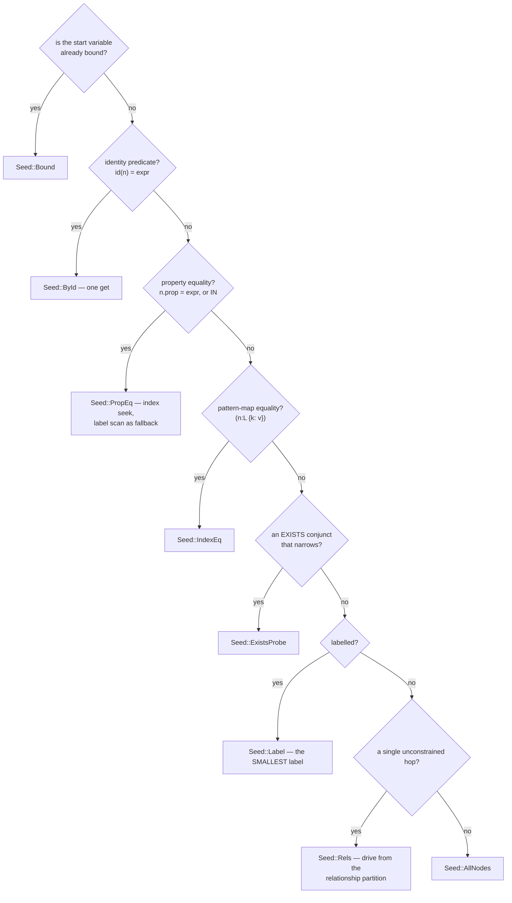

# The planner

Engram's planner is **rule-based, per-call, and has no plan cache**. It picks a
*seed* — where to start reading — and an ordering, then hands off to the
[query path](./query-path.md).

That is a smaller planner than a mature database has, and it is deliberate for
now. The project's own survey concluded that **robustness beats
cardinality-perfection**: the systems that win on graph workloads do not have
flawless cost models, they have operators that do not fall off a cliff when the
estimate is wrong.

## The seed

The first decision, and the one that matters most. Reading from the wrong end
of a pattern is the difference between a point lookup and a corpus scan.



Each variant, and the defect that motivated it:

| seed | when | note |
|---|---|---|
| `Bound` | the variable is already in the row | nothing to choose |
| `ById(expr)` | `elementId(n) = …` or `id(n) = …`, with the other side never reading `n` | one `get`. Without it, `UNWIND $ids AS eid MATCH (n) WHERE elementId(n) = eid` scanned **every node per id** |
| `PropEq{prop, values}` | `n.prop = expr`, or `IN [a, b, …]` | a **seek**, not a label scan. One value or several; the seek unions the per-value probes |
| `IndexEq{key}` | a pattern-map equality `(n:L {k: v})` | the same idea, from the pattern rather than the `WHERE` |
| `ExistsProbe` | a top-level `EXISTS { … }` conjunct that narrows the start | |
| `Label(i)` | labelled, nothing better | **the smallest label** when several apply |
| `Rels` | a single unconstrained-start hop | drives from the relationship partition — such a hop never visits a node it does not bind |
| `AllNodes` | the shape gives nothing better | |

### The label scan always stays as the fallback

`PropEq` and `IndexEq` both keep the smallest-label scan available at runtime,
and **it wins whenever it is the smaller candidate set**.

That is the robustness principle in miniature: the seek is an optimisation with
a correct alternative one comparison away, so a bad estimate costs a comparison
rather than a query.

## Seek admission

An index seek is not always right. Seeking an index that is *not* selective is
slower than scanning the label, so three gates apply:

| gate | value | meaning |
|---|---|---|
| `PROPERTY_SEEK_MIN_LABEL` | 512 | a label smaller than this is scanned |
| `PROPERTY_SEEK_SELECTIVITY` | 16× | a predicate less selective than this is scanned |
| `PROPERTY_SEEK_MAX_PROBE` | 2048 | probes a seek may make |

This is the usual reason an index "is not being used". `--no-property-seek`
forces the scan, so an A/B tells you whether the seek was helping.

## Cardinality estimation, held loosely

Estimates come from maintained statistics and sampling, not from histograms
built by an `ANALYZE` step:

- `count_label_nodes`, `count_all_rels` — maintained, exact.
- `count_adjacent_memo` — memoised degree counts.
- `count_hop_estimate` — a **sampled** estimator, budget 4,096 rows.

The sampled estimator was one of the larger single wins in the engine, and the
reason is instructive: **first-call cardinality estimation had been a tax across
the whole suite, and no profile attributed it** because its cost hid in planning,
split across events no counter aggregated. Fixing it moved queries the
prediction had not named.

The hop-count memo has its own lesson. It keys on **two clocks** — the types'
adjacency epoch and the labels' membership epochs — rather than the global
commit clock, because keying on the global clock is the exact defect
[derived structures](./derived-structures.md) exists to prevent.

## Ordering

For count-only shapes the planner may reorder joins. Two modes:

- a **greedy** ordering that scores the immediate step, and
- a **peak search** over up to 6 orderings (`ORDER_SEARCH_MAX_PATHS`) that
  scores the *peak* intermediate size rather than the next step.

`--no-order-peak-search` keeps the greedy, as the control.

The peak search matters because greedy ordering optimises the wrong thing on a
cyclic join: q2 in the analytical battery began **14.6× behind** with a join
driven from the wrong side, and the peak-ordered plan was the first of three
fixes that ended with it 1.94× ahead.

## Recognisers

Before the general path runs, the interpreter tries a series of **recognisers** —
whole-shape matches that answer a statement more directly:

```text
try_count_fast                     → count(*) with no projection
try_rel_histogram_fast             → relationship type counts
batch::try_columnar_aggregate      → columnar aggregation
batch::try_columnar_projection     → columnar projection
pipeline::plan_and_run_columnar    → the general columnar pipeline
vectorized::try_vectorized_*       → hop-filter-count, hop-topk, unwind-hop-topk
batch::try_columnar_hop_aggregate  → hop aggregation
```

A second pass runs after `fuse_consecutive_matches`, because fusing two `MATCH`
clauses can expose a shape the first pass did not see. **Clause fusion was
itself the source of a one-worker win** that an attribution surfaced — an
operator-coverage fix rather than a planner one.

If nothing recognises the statement, `streamable(q)` decides between the
streaming path and the general clause loop.

## The count fold

The largest structural optimisation the planner does. `count(*)` over a chain
is answered by **folding** rather than enumerating: a folded hop multiplies a
row's *weight* instead of materialising rows, and the product is the same count.

That is why `count(*)` over a 2,500-row cross join answers correctly under a
100-row budget — those rows are never built. See
[Result paging](../using/result-paging.md).

`--no-const-projection-fold` and `--no-agg-topk` are the arms for the related
projection and top-k folds.

## No plan cache

Every statement is planned on every call. A **prepared-plan cache for the
short-query floor** is on the roadmap; full JIT compilation is deliberately
deferred.

The trade today: planning cost is paid per statement, which is part of why the
short-query floor is where it is — and why the sampled estimator's
first-call cost mattered enough to be worth removing.

## Seeing the plan

```cypher
/* engram:trace */ MATCH (p:Person {name: $n})-[:KNOWS]->(f) RETURN count(f)
```

Or `ENGRAM_TRACE_PLAN=1` for the whole server. The output names the seed and
the fold marks:

```text
[plan] seed=label(Person) … folded hops: 1
```

## Next

- [The query path](./query-path.md) — what runs after the plan.
- [Indexes](./indexes.md) — what a seek reads.
- [Derived structures](./derived-structures.md) — where the statistics live.
