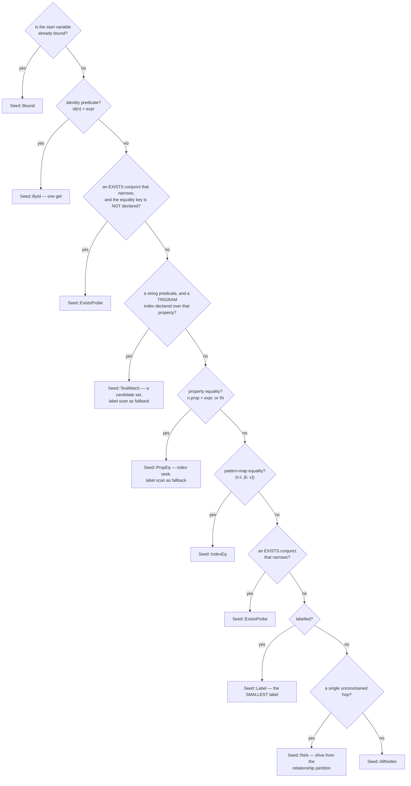

# The planner

Engram's planner is **rule-based, per-call, and has no plan cache**. It picks a
*seed* — where to start reading — and an ordering, then hands off to the
[query path](./query-path.md).

That is a smaller planner than a mature database has, and it is deliberate for
now. The project's own survey concluded that **robustness beats
cardinality-perfection**: the systems that win on graph workloads do not have
flawless cost models, they have operators that do not fall off a cliff when the
estimate is wrong.

## The seed

The first decision, and the one that matters most. Reading from the wrong end
of a pattern is the difference between a point lookup and a corpus scan.


```mermaid
flowchart TD
    S{"is the start variable<br/>already bound?"} -->|yes| B["Seed::Bound"]
    S -->|no| I{"identity predicate?<br/>id(n) = expr"}
    I -->|yes| BI["Seed::ById — one get"]
    I -->|no| PF{"an EXISTS conjunct that narrows,<br/>and the equality key is NOT declared?"}
    PF -->|yes| EP1["Seed::ExistsProbe"]
    PF -->|no| T{"a string predicate, and a TRIGRAM<br/>index declared over that property?"}
    T -->|yes| TM["Seed::TextMatch — a candidate set,<br/>label scan as fallback"]
    T -->|no| P{"property equality?<br/>n.prop = expr, or IN"}
    P -->|yes| PE["Seed::PropEq — index seek,<br/>label scan as fallback"]
    P -->|no| M{"pattern-map equality?<br/>(n:L {k: v})"}
    M -->|yes| IE["Seed::IndexEq"]
    M -->|no| E{"an EXISTS conjunct<br/>that narrows?"}
    E -->|yes| EP2["Seed::ExistsProbe"]
    E -->|no| L{"labelled?"}
    L -->|yes| LB["Seed::Label — the SMALLEST label"]
    L -->|no| R{"a single unconstrained hop?"}
    R -->|yes| RL["Seed::Rels — drive from the<br/>relationship partition"]
    R -->|no| A["Seed::AllNodes"]
```

Each variant, and the defect that motivated it:

| seed | when | note |
|---|---|---|
| `Bound` | the variable is already in the row | nothing to choose |
| `ById(expr)` | `elementId(n) = …` or `id(n) = …`, with the other side never reading `n` | one `get`. Without it, `UNWIND $ids AS eid MATCH (n) WHERE elementId(n) = eid` scanned **every node per id** |
| `TextMatch{prop, query, label}` | `n.prop =~ …`, `CONTAINS`, `STARTS WITH` or `ENDS WITH`, and a trigram index is declared over `prop` | a CANDIDATE set — every id it returns is re-checked by the WHERE that follows, exactly as a property seek's candidates are. `CONTAINS` and `ENDS WITH` had no index path at all before this, because neither is a contiguous span of any sort order. The smallest-label scan stays as the fallback. See [Trigram index](../reference/trigram-index.md) |
| `PropEq{prop, values}` | `n.prop = expr`, or `IN [a, b, …]` | a **seek**, not a label scan. One value or several; the seek unions the per-value probes |
| `IndexEq{key}` | a pattern-map equality `(n:L {k: v})` | the same idea, from the pattern rather than the `WHERE` |
| `ExistsProbe` | a top-level `EXISTS { … }` conjunct that narrows the start | |
| `Label(i)` | labelled, nothing better | **the smallest label** when several apply |
| `Rels` | a single unconstrained-start hop | drives from the relationship partition — such a hop never visits a node it does not bind |
| `AllNodes` | the shape gives nothing better | |

The table reads in cascade order with one exception, and the exception is the
interesting part.

**The exists probe outranks an UNDECLARED equality.** The probe is tried in two
places: ahead of the text, property and pattern-map seeks when the equality key
is not declared in the catalogue, and in the position the table gives it when it
is. Seeking a key the catalogue never promised probes — or builds — an unscoped
index the operator never asked for, and usually loses to the label scan anyway.
A declared equality keeps its place ahead of the probe, because that seek is the
one the catalogue promised.

Two things the cascade gates cheaply: the text seek asks `any_trigram_index()`
first, so a corpus with no trigram index pays one boolean, and a pattern whose
string predicate compares against a VARIABLE declines outright — the condition
would have to be derived per row, and a seed is chosen once for the whole clause.

### The label scan always stays as the fallback

`PropEq` and `IndexEq` both keep the smallest-label scan available at runtime,
and **it wins whenever it is the smaller candidate set**.

That is the robustness principle in miniature: the seek is an optimisation with
a correct alternative one comparison away, so a bad estimate costs a comparison
rather than a query.

## Seek admission

An index seek is not always right. Seeking an index that is *not* selective is
slower than scanning the label, so three gates apply:

| gate | value | meaning |
|---|---|---|
| `PROPERTY_SEEK_MIN_LABEL` | 512 | a label smaller than this is scanned |
| `PROPERTY_SEEK_SELECTIVITY` | 16× | a predicate less selective than this is scanned |
| `PROPERTY_SEEK_MAX_PROBE` | 2048 | probes a seek may make |

This is the usual reason an index "is not being used". `--no-property-seek`
forces the scan, so an A/B tells you whether the seek was helping.

### Composite seeks

A pattern carrying two or more single-valued equalities over properties that a
declared composite index covers probes that index once, rather than probing each
component and intersecting the results. `CREATE INDEX … FOR (n:UserDataNode) ON
(n.userId, n.nodeType)` used to be its leading key's index plus a note that the
trailing key counted as declared, so a seek on both took the smaller of two whole
match sets.

The composite is DERIVED from its components rather than maintained beside them:
the join reads the component indexes' live entries in key order, with the overlay
resolved as a query would see it, and takes no record read. It is string-only —
a component value that is not a string contributes no tuple, and the count of
what was left out is carried on the index so a census can add it back. Where
either condition fails the caller keeps its per-key path.

[Indexes](./indexes.md) has what a seek reads.

## Cardinality estimation, held loosely

Estimates come from maintained statistics and sampling, not from histograms
built by an `ANALYZE` step:

- `count_label_nodes`, `count_all_rels` — maintained, exact.
- `count_adjacent_memo` — memoised degree counts.
- `count_hop_estimate` — a **sampled** estimator, budget 4,096 rows.

The sampled estimator was one of the larger single wins in the engine, and the
reason is instructive: **first-call cardinality estimation had been a tax across
the whole suite, and no profile attributed it** because its cost hid in planning,
split across events no counter aggregated. Fixing it moved queries the
prediction had not named.

The hop-count memo has its own lesson. It keys on **two clocks** — the types'
adjacency epoch and the labels' membership epochs — rather than the global
commit clock, because keying on the global clock is the exact defect
[derived structures](./derived-structures.md) exists to prevent.

## Ordering

For count-only shapes the planner may reorder joins. Two modes:

- a **greedy** ordering that scores the immediate step, and
- a **peak search** over up to 6 orderings (`ORDER_SEARCH_MAX_PATHS`) that
  scores the *peak* intermediate size rather than the next step.

`--no-order-peak-search` keeps the greedy, as the control.

The peak search matters because greedy ordering optimises the wrong thing on a
cyclic join: LSQB q2 began the optimisation campaign well behind Neo4j with a
join driven from the wrong side, and the peak-ordered plan was the first of three
fixes that turned that loss into a lead — 240 ms at SF3 against Neo4j's 6,891
today. See [Three engines at SF3 and SF10](../measurements/three-engines-sf3-sf10.md)
for where it stands on every query.

## Recognisers

Before the general path runs, the interpreter tries a series of **recognisers** —
whole-shape matches that answer a statement more directly:

```text
try_count_fast                     → count(*) with no projection
try_rel_histogram_fast             → relationship type counts
batch::try_columnar_aggregate      → columnar aggregation
batch::try_columnar_projection     → columnar projection
pipeline::plan_and_run_columnar    → the general columnar pipeline
vectorized::try_vectorized_*       → hop-filter-count, hop-topk, unwind-hop-topk
batch::try_columnar_hop_aggregate  → hop aggregation
```

A second pass runs after `fuse_consecutive_matches`, because fusing two `MATCH`
clauses can expose a shape the first pass did not see. **Clause fusion was
itself the source of a one-worker win** that an attribution surfaced — an
operator-coverage fix rather than a planner one.

If nothing recognises the statement, `streamable(q)` decides between the
streaming path and the general clause loop.

## The count fold

The largest structural optimisation the planner does, and by now several
mechanisms rather than one.

**Weights.** `count(*)` over a chain is answered by **folding** rather than
enumerating: a folded hop multiplies a row's *weight* instead of materialising
rows, and the product is the same count. That is why `count(*)` over a
2,500-row cross join answers correctly under a 100-row budget — those rows are
never built. See [Result paging](../using/result-paging.md).

**Symmetry breaking.** When every transposition of a set of node variables
extends to an automorphism of the whole pattern — LSQB q3's
`(p1)-[:KNOWS]-(p2)-[:KNOWS]-(p3)-[:KNOWS]-(p1)`, each person carrying the same
country sub-pattern — the fold enumerates ONE id order (`id(p1) < id(p2) <
id(p3)`, an inline `GtBound` on each folded member's binding hop) and multiplies
by the set's size factorial.

The failure mode of the idea is a silently wrong count, so each of its four
obligations is a decline unless it holds. Three are properties of the query: the
symmetry itself, that nothing reads the set, and that the constraints land where
they can be evaluated. The fourth is a property of the DATA — two symmetric
variables can bind the same node through a self-loop, and such a result has a
smaller orbit than the multiplier assumes — so the joining types' self-loop
counts are read at execution and never cached with the plan.

In the LSQB battery it reaches q3 and nothing else, and its A/B there was
banked only because the two arms' distributions separated completely, with every
count identical between the arms. `--no-fold-symmetry-breaking` is the control.

**The hoisted close.** A fold close probes the adjacency table for the bound
side's row, and that row is fixed for its whole subtree — q3's triangle close is
10,101,202 of its 12,533,920 fold walks, every one a probe of the same ~36-entry
row. Past `--fold-hoist-after` probes (default 8) the row is copied once per
binding and sorted by peer instead. The threshold exists because a hoist costs
the whole row while a probe costs a lookup, so a binding probed once or twice
must never pay a row for it.

**The memo.** A folded level whose subtree reads nothing outside itself is a pure
function of the node id, so it is computed once and reused.

**The probe cap needs one root.** A `count(*)` under a `LIMIT` may stop early
once the total is provably past `skip + limit`. But roots' weights MULTIPLY to
make the answer, while the cap is judged against one shared accumulator, so a
single root's partial is not the count. Once the first root's partial crossed the
cap, the next root's pass broke on its first row with nothing kept, and a
`MATCH … RETURN 1 LIMIT 5` whose true answer was five rows answered **none, with
no error**. The cap is therefore dropped whenever the fold has more than one
root, which costs a full sum on those folds and nothing else. The defect predates
symmetry breaking — the same corpus answers zero rows with symmetry off — but the
`|S|!` multiplier lands on the first root, so it made the cap `|S|!` times easier
to cross.

Each of these has an A/B arm, and so do the related projection and top-k folds.
The flags, and what each arm does instead, are in
[Server CLI](../reference/cli.md).

## No plan cache

Every statement is planned on every call. A **prepared-plan cache for the
short-query floor** is on the roadmap; full JIT compilation is deliberately
deferred.

The trade today: planning cost is paid per statement, which is part of why the
short-query floor is where it is — and why the sampled estimator's
first-call cost mattered enough to be worth removing.

## Seeing the plan

`ENGRAM_TRACE_PLAN=1` makes the server print what the planner decided, to its
own log. Two dumps, and they answer different questions:

```text
[plan] seed=<seed var> rows=<n> paths=<n> peak=<estimate> total=<estimate>
[plan]   <i>: <the path, written var-[TYPE]->var>
[fold] hop <i>: <src>-[<types>]-><end> fold=<bool> root_src=<var> track=<bool>
                reset=<bool> inline=<n> labels=<[…]>
```

The `[plan]` lines come from the count-only ordering pass, so they appear only
for a statement whose whole shape is one `MATCH` and a non-`DISTINCT` `count(*)`
— and only when the peak search actually chose an ordering.

The `[fold]` lines say which hops fold, which is the fact that is otherwise
invisible. A close prints `->CLOSE <var>` in place of its end variable. Whether
a variable folds or MATERIALISES changed a close's cost from about 50 ns per leaf
to about 1,000 on the pod, with identical per-leaf counters and nothing in the
code to say why — which is what this dump exists for.

`/* engram:trace */` at the head of a statement is a different instrument. It
dumps that one statement's COUNTERS to the server's log, exactly as if
`ENGRAM_TRACE_COUNTERS` were set for that statement alone — on a server started
with `ENGRAM_TRACE_MARKER=1`, and otherwise not at all. It prints no plan, and
nothing comes back to the client.

## Next

- [The query path](./query-path.md) — what runs after the plan.
- [Indexes](./indexes.md) — what a seek reads.
- [Derived structures](./derived-structures.md) — where the statistics live.
