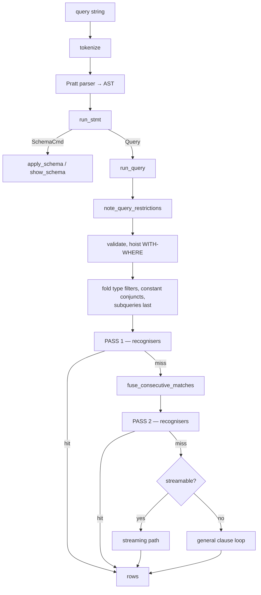

# The query path

From a string on the wire to rows, with the choices made along the way.

## The shape



## The front end

`engram-cypher` knows **nothing** about the store. It depends only on
`engram-observe`.

- **`token.rs`** — the lexer.
- **`parser.rs`** — a **Pratt** expression parser, bounded at
  `MAX_EXPR_DEPTH` 64, with a declared minimum parser stack of 4 MiB so that
  bound is *reachable* rather than academic.
- **`clause.rs`** — `parse_any` / `parse_statement` producing a `Stmt`.
- **`eval.rs`** — expression evaluation with three-valued logic, reaching the
  graph only through a `GraphHooks` trait the graph layer implements.

That separation is what lets the parser and the TCK harness be tested without a
store, and it is enforced by the dependency graph rather than by convention.

## Predicates are registered from the AST

```rust
note_query_restrictions(graph, query, &params);
```

This happens **once, before any planner is chosen**, and the reason is a real
defect:

There are at least three planners that can serve a single-node `MATCH` —
`match_path`, the streaming path, and `try_columnar_projection`. A hook in one
of them covers only the statements that planner happens to win. The first
attempt put hooks in two of the three and registered **nothing at all** for
`MATCH (n:P {tag: 'x'}) RETURN n`, because the columnar projection served it.

Registering from the AST makes that class of miss impossible: **the predicate is
a property of the statement, not of the plan chosen for it.**

It also brings the clause's own `WHERE` into scope, which no planner-level site
had — and without it a restriction over-approximates its own statement and
aborts commits that were fine.

## Rewrites before planning

| rewrite | effect |
|---|---|
| `hoist_with_where` | lifts a `WITH … WHERE` so it can filter earlier |
| `fold_type_filters` | folds a relationship-type test into the hop |
| `fold_constant_conjuncts` | evaluates what does not depend on the row |
| `subqueries_last` | orders subqueries after the clauses that bind them |
| `fuse_consecutive_matches` | merges adjacent `MATCH` clauses — run *between* the two recogniser passes, because fusing can expose a shape |
| `fold_chain_counts` | the count fold |

## The recognisers

Whole-shape matches, tried in order. Each either answers the statement or
declines cleanly.

| recogniser | shape |
|---|---|
| `try_count_fast` | a bare `count(*)` |
| `try_rel_histogram_fast` | relationship-type counts |
| `try_columnar_aggregate` | aggregation over a columnar scan |
| `try_columnar_projection` | projection over a columnar scan |
| `plan_and_run_columnar` | **the general columnar pipeline** |
| `try_vectorized_hop_filter_count` | hop, filter, count |
| `try_vectorized_hop_topk` | hop with `ORDER BY … LIMIT` |
| `try_vectorized_unwind_hop_topk` | the same, driven by `UNWIND` |
| `try_vectorized_collect_ic9_topk` | a collect-shaped top-k |
| `try_columnar_hop_aggregate` | aggregation over a hop |

Declining is normal and cheap. The general path underneath is always correct,
so a recogniser that refuses an unfamiliar shape costs a check.

## The columnar pipeline

`plan_and_run_columnar` is the main engine for recognised shapes, and it works
on `DataChunk`:

```rust
struct DataChunk {
    vars: Vec<String>,        // bound variables, in binding order
    var_kinds: Vec<VarKind>,  // node or relationship, per var
    ids: Vec<Vec<u64>>,       // ONE ID COLUMN PER VAR
    selection: Vec<usize>,    // live rows; filters shrink this,
                              // ID COLUMNS ARE NEVER COPIED
    used_rels: Vec<Vec<u64>>, // isomorphism tracking
    prov: Vec<usize>,         // OPTIONAL outer-row provenance
    weights: Vec<u64>,        // count-fold multiplicities
}
```

This is the Kuzu/GraphflowDB vector model: **id vectors plus a selection
vector**, with properties fetched lazily by id from the right `ColumnFamily`.

Operators: `scan` → `expand`* → `filter` → `project`, with `semijoin`, the count
fold, and a join reorder.

Two fields carry non-obvious work:

- **`prov`** is `OPTIONAL MATCH` provenance. It records which *outer* row each
  row descends from, so the optional steps can run over the whole outer chunk in
  one pass and the merge can still interleave null-fills in the right order. It
  is empty on every non-optional chunk, so the common path pays an `is_empty`
  check.
- **`weights`** are the count fold. A materialised hop multiplies rows; the fold
  multiplies weights; the product is the same count.

### Morsel parallelism

`DataChunk::expand` can split its driving rows into morsels and run them through
the installed [`ScopedExec`](./concurrency.md), concatenating partials **in
morsel order** so the result is byte-identical to the serial path.

Five gates admit it: the lever is on, an executor is installed, **no active
transaction on the thread**, enough driving rows, and no fold weights.

The transaction gate is the sharp one — the read-your-writes overlays and the
OCC read set are thread-local, so a worker would silently read committed state
and record nothing.

## Variable-length expansion

Two implementations, and which one a statement gets matters enormously.

**`expand_var_length`** — depth-first over rel-distinct walks. Always correct,
and materialises every path.

**`expand_var_length_bfs`** — a **frontier BFS over a visited set**, producing
each reachable node once at its shortest depth, so "the O(paths) flat rows the
enumerating path builds and then collapses at the `DISTINCT` never exist."

Admission, stated in the source: `min == 1`, no relationship or path variable,
no relationship-property test, and an end the breaker consumes `DISTINCT`-only.

`shortestPath` has the same shape: `try_shortest_path_bfs` handles both
endpoints bound — bidirectional for an unbounded `*`, a memoised forward tree
for `*..max` — and exists specifically to replace an enumeration that exhausted
the process on `(a)-[:KNOWS*]-(b)`.

## The streaming path and the clause loop

If nothing recognises the statement:

**Streaming** (`run_streaming`) pushes rows one at a time through chained sinks.
Reading clauses push, aggregation folds into per-group accumulators, `ORDER BY`
buffers.

**The general clause loop** handles everything else — `Create`, `Merge`, `Set`,
`Remove`, `Delete`, `Foreach`, `Call`, and any `MATCH` shape the streaming path
declines.

## The row budget

`budget_check` refuses a statement whose intermediate row set outgrows
`--row-budget`:

```text
row budget exceeded: the statement materialised more than 20000000
intermediate rows; it would exhaust memory rather than stream
```

The alternative is the OOM killer, which refuses nothing and takes every other
session with it.

The parallel path checks it too, and getting that right needed a fix: workers
originally materialised each partial before checking, where the serial loop
refuses incrementally. They now share a produced-rows account so they stop where
the serial loop would.

## Next

- [The planner](./planner.md) — how the seed is chosen.
- [The write path](./write-path.md) — the other half.
- [Concurrency](./concurrency.md) — the parallelism seam.
