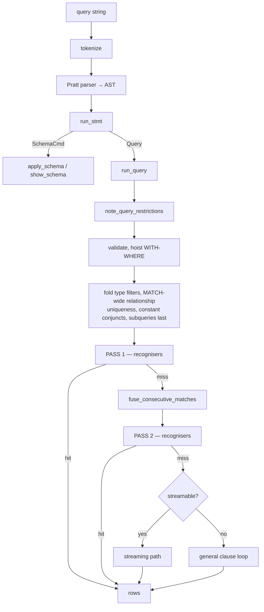

# The query path

From a string on the wire to rows, with the choices made along the way.

## The shape


```mermaid
flowchart TD
    A["query string"] --> B["tokenize"]
    B --> C["Pratt parser → AST"]
    C --> D["run_stmt"]
    D -->|SchemaCmd| E["apply_schema / show_schema"]
    D -->|Query| F["run_query"]
    F --> G["note_query_restrictions"]
    G --> H["validate, hoist WITH-WHERE"]
    H --> I["fold type filters, MATCH-wide relationship<br/>uniqueness, constant conjuncts, subqueries last"]
    I --> J["PASS 1 — recognisers"]
    J -->|hit| Z["rows"]
    J -->|miss| K["fuse_consecutive_matches"]
    K --> L["PASS 2 — recognisers"]
    L -->|hit| Z
    L -->|miss| M{"streamable?"}
    M -->|yes| N["streaming path"]
    M -->|no| O["general clause loop"]
    N --> Z
    O --> Z
```

## The front end

`engram-cypher` knows **nothing** about the store. Its internal dependencies
are `engram-observe` and `engram-proc` — the assertion vocabulary and the
procedure catalogue, both declarations, neither able to read a row.

- **`token.rs`** — the lexer.
- **`parser.rs`** — a **Pratt** expression parser, bounded at
  `MAX_EXPR_DEPTH` 64, with a declared minimum parser stack of 4 MiB so that
  bound is *reachable* rather than academic.
- **`clause.rs`** — `parse_any` / `parse_statement` producing a `Stmt`.
- **`eval.rs`** — expression evaluation with three-valued logic, reaching the
  graph only through a `GraphHooks` trait the graph layer implements.
- **`regex/`** — the `=~` engine: a compile cache, a refusal scanner that names
  what it will not compile (backreferences and lookaround, chiefly, rather than
  reporting the underlying crate's wording), and the trigram prefilter that
  turns a pattern into the trigrams a matching value must contain.

That separation is what lets the parser and the TCK harness be tested without a
store, and it is enforced by the dependency graph rather than by convention.

## Predicates are registered from the AST

```rust
note_query_restrictions(graph, query, &params);
```

This happens **once, before any planner is chosen**, and the reason is a real
defect:

There are at least three planners that can serve a single-node `MATCH` —
`match_path`, the streaming path, and `try_columnar_projection`. A hook in one
of them covers only the statements that planner happens to win. The first
attempt put hooks in two of the three and registered **nothing at all** for
`MATCH (n:P {tag: 'x'}) RETURN n`, because the columnar projection served it.

Registering from the AST makes that class of miss impossible: **the predicate is
a property of the statement, not of the plan chosen for it.**

It also brings the clause's own `WHERE` into scope, which no planner-level site
had — and without it a restriction over-approximates its own statement and
aborts commits that were fine.

## Rewrites before planning

| rewrite | effect |
|---|---|
| `hoist_with_where` | lifts a `WITH … WHERE` so it can filter earlier |
| `fold_type_filters` | folds a relationship-type test into the hop |
| `enforce_clause_rel_uniqueness` | states relationship uniqueness across one `MATCH`'s comma paths as hidden `WHERE` conjuncts — below |
| `fold_constant_conjuncts` | evaluates what does not depend on the row |
| `subqueries_last` | orders subqueries after the clauses that bind them |
| `fuse_consecutive_matches` | merges adjacent `MATCH` clauses — run *between* the two recogniser passes, because fusing can expose a shape |
| `fold_chain_counts` | the count fold |

### Relationship uniqueness spans the whole `MATCH`

openCypher scopes relationship isomorphism to the `MATCH` clause: no
relationship binds twice anywhere in `MATCH p1, p2, …`, while separate clauses
(`MATCH p1 MATCH p2`) may reuse one. Every matcher in the engine — the general
matcher's per-path `used` set, the pipeline's `used_rels` reset at each comma
path — enforces it within ONE path, which is the rule for separate clauses.

`enforce_clause_rel_uniqueness` restores the clause rule before any recogniser
or matcher reads the statement, as predicates the `WHERE` already knows how to
run. Every pair of relationship patterns in different comma paths of one
`MATCH` whose types can meet (either untyped, or sharing a type) is named — an
anonymous one gets a hidden `__iso<n>` variable — and kept apart by a conjunct
ANDed onto the clause's `WHERE`:

| the pair | conjunct |
|---|---|
| two single hops | `a <> b` |
| a single hop and a variable-length list | `NOT a IN list` |
| two variable-length lists | `none(x IN l1 WHERE x IN l2)` |

Relationships compare by identity, so each conjunct says exactly "not the same
relationship". A pair is skipped where it cannot meet anyway: two single hops
whose ends the `WHERE` already keeps apart (`WHERE NOT t = tag`, in the
orientations the directions allow), or whose ends carry inline property maps
pinning one key to two different constants (`{id: $city1Id}` against
`{id: $city2Id}`). A relationship variable named in two paths is one
relationship joined, not two, and is left alone. A statement that projects `*`
is declined, because the hidden names would surface in its columns, and the
decline is counted.

The defect this closes was a wrong answer, not a slow one. LDBC SNB BI query 17
matches two `HAS_MEMBER` paths from one forum in a single `MATCH`, which makes
the two members different people; scoped per path, the engine let one person
play both roles, and counted people replying to their own messages. Its `LIMIT`
kept the row count equal to the reference, so a row-count comparison could not
see it; the answer is now checked by value (see
[the current measurements](../measurements/three-engines-sf3-sf10.md#bi-17-checked-by-value)).

The pipeline's fast operators — the multi-path chain, the semijoin and the
count fold — still implement the separate-clause rule, which is also what
`fuse_consecutive_matches` hands them. A comma shape that the rewrite has given
uniqueness conjuncts is therefore declined by them and runs on the general
path: correct, and slower where they used to claim it. Teaching those operators
the clause rule is an open item.

## The recognisers

Whole-shape matches, tried in order. Each either answers the statement or
declines cleanly.

| recogniser | shape |
|---|---|
| `try_count_fast` | a bare `count(*)` |
| `try_rel_histogram_fast` | relationship-type counts |
| `try_columnar_aggregate` | aggregation over a columnar scan |
| `try_columnar_projection` | projection over a columnar scan |
| `plan_and_run_columnar` | **the general columnar pipeline** |
| `try_vectorized_hop_filter_count` | hop, filter, count |
| `try_vectorized_hop_topk` | hop with `ORDER BY … LIMIT` |
| `try_vectorized_unwind_hop_topk` | the same, driven by `UNWIND` |
| `try_vectorized_collect_ic9_topk` | a collect-shaped top-k |
| `try_columnar_hop_aggregate` | aggregation over a hop |

Declining is normal and cheap. The general path underneath is always correct,
so a recogniser that refuses an unfamiliar shape costs a check.

## The columnar pipeline

`plan_and_run_columnar` is the main engine for recognised shapes, and it works
on `DataChunk`:

```rust
struct DataChunk {
    vars: Vec<String>,        // bound variables, in binding order
    var_kinds: Vec<VarKind>,  // node or relationship, per var
    ids: Vec<Vec<u64>>,       // ONE ID COLUMN PER VAR
    selection: Vec<usize>,    // live rows; filters shrink this,
                              // ID COLUMNS ARE NEVER COPIED
    used_rels: Vec<Vec<u64>>, // isomorphism tracking
    prov: Vec<usize>,         // OPTIONAL outer-row provenance
    weights: Vec<u64>,        // count-fold multiplicities
}
```

This is the Kuzu/GraphflowDB vector model: **id vectors plus a selection
vector**, with properties fetched lazily by id from the right `ColumnFamily`.

Operators: `scan` → `expand`* → `filter` → `project`, with `semijoin`, the count
fold, and a join reorder.

Two fields carry non-obvious work:

- **`prov`** is `OPTIONAL MATCH` provenance. It records which *outer* row each
  row descends from, so the optional steps can run over the whole outer chunk in
  one pass and the merge can still interleave null-fills in the right order. It
  is empty on every non-optional chunk, so the common path pays an `is_empty`
  check.
- **`weights`** are the count fold. A materialised hop multiplies rows; the fold
  multiplies weights; the product is the same count. A symmetry-broken fold
  also lands its `|S|!` multiplier here, on the first root. A fold with more
  than one root cannot use its early-stop probe cap at all: the roots' weights
  multiply, so no single root's running total is the count — a defect that
  predated symmetry breaking and that the `|S|!` multiplier made `|S|!` times
  easier to reach. See [The planner](./planner.md#the-count-fold).

### Morsel parallelism

`DataChunk::expand` can split its driving rows into morsels and run them through
the installed [`ScopedExec`](./concurrency.md), concatenating partials **in
morsel order** so the result is byte-identical to the serial path.

Five gates admit it: the lever is on, an executor is installed, **no active
transaction on the thread**, enough driving rows, and no fold weights.

The transaction gate is the sharp one — the read-your-writes overlays and the
OCC read set are thread-local, so a worker would silently read committed state
and record nothing.

**The count fold splits too, and its floor is different.** A fold's driving row
is an entire nested walk rather than a cheap probe, so the 256-row floor that
suits `expand` is wrong for it: LSQB q3 seeds on `country`, and the SNB data
has 111 countries at every scale factor — under 256, so that floor would keep
q3 on one thread however many workers were idle. The fold's floor is 2. When no
level memoises it also cuts finer than one morsel per worker, because a fold's
rows are wildly uneven and `width` contiguous chunks hand one worker the
giant; the finer cut is gated on nothing
memoising, since each morsel builds a fresh `FoldState` and rebuilding a memo
per morsel could cost more than the balance wins. It has no fold-weights gate,
being the operator that produces them, and `ENGRAM_NO_PARALLEL_FOLD` is its A/B
arm within a parallel run.

Whether a morsel body gets threads at all is a process-wide decision rather than
a per-statement one — see [Concurrency](./concurrency.md). Within what it is
granted, the server's executor has the calling thread work the morsels itself
and starts helpers only on demand: one starts at once, waits out a short ramp
(250 µs), and is sent home unused if the run ends first; past the ramp, helpers
start two at a time while the unclaimed morsels outnumber the helpers already
started but not yet working. A run of a few heavy morsels — a seed split's
shares — therefore gets a thread for each, up to its grant, and a run shorter
than the ramp pays one spawn and one join.

## Variable-length expansion

Two implementations, and which one a statement gets matters enormously.

**`expand_var_length`** — depth-first over rel-distinct walks. Always correct,
and materialises every path.

**`expand_var_length_bfs`** — a **frontier BFS over a visited set**, producing
each reachable node once at its shortest depth, so "the O(paths) flat rows the
enumerating path builds and then collapses at the `DISTINCT` never exist."

Admission, stated in the source: `min == 1`, no relationship or path variable,
no relationship-property test, and an end the breaker consumes `DISTINCT`-only.

`shortestPath` has the same shape: `try_shortest_path_bfs` handles both
endpoints bound — bidirectional for an unbounded `*`, a memoised forward tree
for `*..max` — and exists specifically to replace an enumeration that exhausted
the process on `(a)-[:KNOWS*]-(b)`.

## The streaming path and the clause loop

If nothing recognises the statement:

**Streaming** (`run_streaming`) pushes rows one at a time through chained sinks.
Reading clauses push, aggregation folds into per-group accumulators, `ORDER BY`
buffers.

**The general clause loop** handles everything else — `Create`, `Merge`, `Set`,
`Remove`, `Delete`, `Foreach`, `Call`, and any `MATCH` shape the streaming path
declines.

**A read-only prefix streams ahead of what the loop must run.** `streamable`
answers for the whole statement, so one procedure `CALL` in the middle used to
send every clause, the expensive prefix included, to the materialising loop.
`streamable_prefix_end` now cuts a statement that writes nothing at its last
`WITH` (not `WITH *`) before the first clause the pipeline cannot run, provided
at least one `MATCH` precedes it. The clauses up to that `WITH` run as their own
streamed statement, closed by the `WITH`'s projection written as a `RETURN`;
the `WITH`'s own `WHERE` filters those rows; and the loop starts after it. A
statement that writes is never cut, because a writer's reads build its
transaction's read-set and the pipeline is not where that is kept.
`--no-prefix-streaming` is the A/B arm.

### Paths bound in the middle

A path whose end is bound in the row is turned round to walk from that end
(`reverse_bound_end_path`). Two further rules cover a bound node that is not at
an end:

- **A path bound only in its middle is walked both ways from that node**
  (`split_at_bound_interior`). With both ends unbound and an interior node
  bound, the path is split at the first such node: the prefix is reversed to
  run from it back to the start, and the suffix runs from it as written. The
  split gives up the isomorphism check between the two halves, so it is taken
  only where that check has nothing to decide: every hop typed, the prefix's
  types disjoint from the suffix's, the prefix fixed-length (the suffix may be
  variable-length), and no path variable or `shortestPath`. Without it the
  unbound start would be seeded by a label scan, with the bound node only
  pinning one hop's far end.
- **A both-bound path whose end repeats across rows is answered as a join at
  its first interior node** (`join_at_middle`). Walked per row from either end,
  such a leg repeats the same work for every row that shares the end. Instead,
  at an end's second sighting in the statement, the far half — from the end
  back to the first interior node — is walked once and grouped by the node it
  reaches, and each row walks only its own first hop and looks each neighbour
  up. It is exact only where the far half is a function of the end alone, so it
  declines unless every hop is typed and fixed-length, no interior node is
  bound or carries a property map, the first hop's types occur nowhere in the
  far half, and there is no path variable or `shortestPath`. It also steps
  aside for a hub start (a first hop more than four times the end's), for a far
  half over 262,144 rows (`MIDDLE_JOIN_BUILD_ROWS`), inside a writing
  transaction, when the clause's `WHERE` reads the path's interior nodes (the
  far half is built without that `WHERE`, so it would not be pruned), and where
  the first-hop `WHERE` memo already claims the leg. The memo is per thread and
  per statement, keyed by the pattern's content rather than its address, so the
  copies a parallel stage hands its workers share one build each.

### Splitting the general path

Morsel parallelism is not confined to the columnar pipeline. The general
matcher splits its work across the same installed executor, under gates of its
own — an executor wider than one, no open transaction on the thread, no
plain-`LIMIT` early stop — and with the same merge rule, partials concatenated
in morsel order so the rows arrive as the serial drive would produce them:

| split | unit | when |
|---|---|---|
| row split | a stage's input rows | at least `parallel_min_rows` (256) of them, or fewer where each row's projection walks a pattern |
| **seed split** (`drive_seeds`) | a first-stage `MATCH`'s seed set | a first stage has one input row by construction, so the row split can never take it; the seeds are split instead — 256 of them, or two where each seed walks several hops |
| **continuation split** (`drive_continuation_parallel`) | the rows the stage's first clause produces | the stage is too thin for the row split, its first clause is a non-optional `MATCH`, a later clause is a `MATCH` or `OPTIONAL MATCH`, and every clause reads (`MATCH`, `WITH`, `UNWIND`) |
| stage aggregation (`parallel_aggregate_stage`) | shares of the seed label | a first-stage `MATCH` seeded by a label scan, feeding a grouping keyed by the seed node itself whose folds merge exactly (no `DISTINCT`, no float sum or average): each worker drives the whole stage — its `WHERE`, grouping and folds included — over its share into its own projector, and the partials merge in share order |

The seed and continuation splits window their buffers, so a split holds one
window of rows rather than a whole drive's output.

## The row budget

`budget_check` refuses a statement whose intermediate row set outgrows
`--row-budget`:

```text
row budget exceeded: the statement materialised more than 20000000
intermediate rows; it would exhaust memory rather than stream
```

The alternative is the OOM killer, which refuses nothing and takes every other
session with it.

The parallel path checks it too, and getting that right needed a fix: workers
originally materialised each partial before checking, where the serial loop
refuses incrementally. They now share a produced-rows account so they stop where
the serial loop would.

## Next

- [The planner](./planner.md) — how the seed is chosen.
- [The write path](./write-path.md) — the other half.
- [Concurrency](./concurrency.md) — the parallelism seam.
