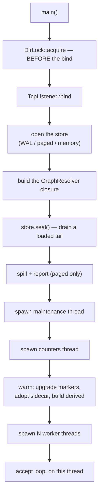
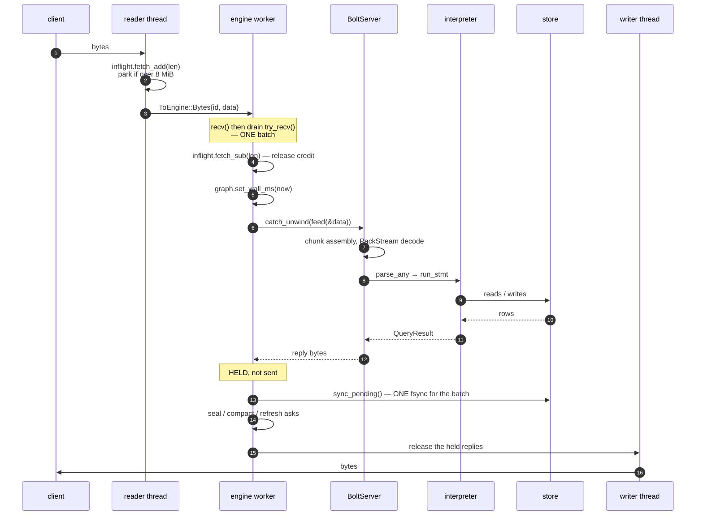

# Request lifecycle

One connection, one statement, from socket to socket. This is the path
[the overview](./overview.md) sketches, with the details that matter.

## Startup, first

Two orderings are load-bearing:

**The lock is taken before the bind**, not merely before serving. A second
server that binds and *then* refuses has, for that moment, taken the port from
the one that legitimately holds the data — which during a restart race is
exactly when it happens, and turns a clean refusal into an outage.

**The tail is sealed at startup**, because every read of a non-empty tail takes
the latch writers hold. A recovered server that skipped this served its whole
history from behind the write lock.

**Warming happens before the listener accepts**, so the first query does not pay
for the corpus.

## A statement

### Backpressure (step 2)

A connection may have **8 MiB** of unacknowledged bytes queued to the engine.
Past that the reader **parks**, one millisecond at a time.

Before this existed, the reader sent into an unbounded channel as fast as it
could read, so a fast client against a slow engine grew the queue without limit.

### One batch (step 4)

A worker does not process one message at a time. It blocks on `recv`, then
drains everything else already waiting with `try_recv`, and treats the lot as
one batch. That batching is what makes group commit work.

### The wall clock (step 6)

`set_wall_ms(now)` immediately before `feed` is **the only place a real clock
enters the engine**. Everything below reads time from what it was handed, and
anything needing ordering rather than wall time uses the store's commit counter.

### Panic isolation (step 7)

`catch_unwind` around `feed`. A panic drops that session and **the worker
survives**.

Before it, one bad statement killed a worker and silently stranded every
connection pinned to it — a failure that presents to those clients as a hang,
not an error.

### The replies are held (step 13)

The worker collects every reply its batch produced, pays **one** `fsync`, and
only then releases them.

With one client nothing queues during the fsync, so it degrades to one fsync per
write and costs nothing. With eight, the fsync's few milliseconds are long
enough that all eight send their next request, so the next batch shares one
fsync eight ways.

Before group commit existed, write throughput was **flat at 375 → 380 ops/s
from one to eight clients**.

## Threads

| thread | count | |
|---|---|---|
| accept loop | 1 (the main thread) | pins each connection to a worker by `id % workers` |
| reader | 1 per connection | socket → engine, with the credit loop |
| writer | 1 per connection | engine → socket |
| engine worker | `--workers` | owns its sessions in a map; batches, runs, fsyncs, replies |
| maintenance | 1 | compaction, spilling, log truncation, derived refresh |
| counters | 1 | the two stderr lines, every 30 s, on change only |

**Two OS threads per connection** is why `--max-connections` exists at all.

A connection pins to `id % workers`, which means a worker's sessions are its
own: no cross-worker session map, no lock around it.

## After the batch

Before releasing replies, the worker checks three thresholds:

| check | trigger |
|---|---|
| seal | `tail_versions >= --seal-after` |
| compaction | `segment_count >= --compact-after`, or the tombstone ratio |
| derived refresh | `--refresh-after-writes` commit stamps since the last |

Compaction and refresh are *asks* — a message to the maintenance thread — so a
worker never does that work on a statement's critical path. Sealing is done
inline by whichever worker's batch crosses the threshold, because it must
happen under the log latch anyway.

## Session state

A session is a `BoltServer` plus its reply channel and its inflight counter. The
`BoltServer` holds the protocol state machine and any open result streams.

`RESET` returns it to a known state; `GOODBYE` closes it; a panic drops it.

## What the client never waits on

Worth listing, because they are the things that would otherwise show up as
latency:

- **Compaction** — maintenance thread.
- **Spilling** — maintenance thread.
- **Derived refresh** — maintenance thread, which is the entire point.
- **Log truncation** — maintenance thread.

What a client *does* wait on: its statement, and one fsync shared with whatever
else was in the batch.

## Next

- [The query path](./query-path.md) — inside `run_stmt`.
- [The write path](./write-path.md) — inside a commit.
- [Concurrency](./concurrency.md) — the worker model in detail.
