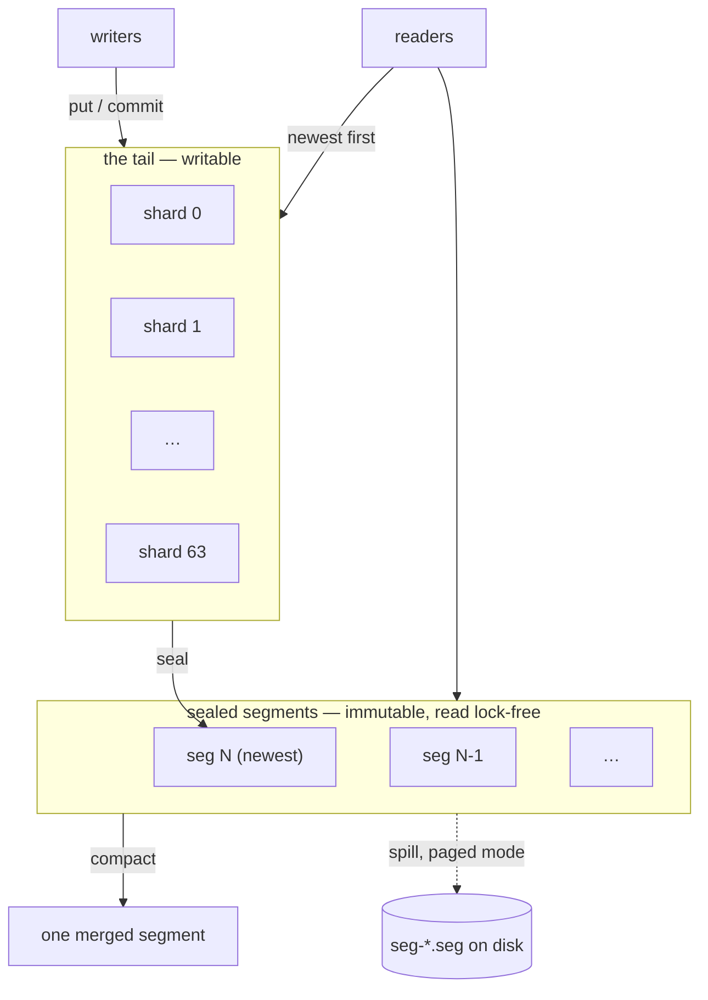

# The storage engine

`engram-store` is an **MVCC log-structured store**: a writable in-memory tail
in front of immutable sealed segments, with every version addressed by a key
ending in its commit timestamp.

There is no graph in this layer. It stores versioned key-value rows, and
[the graph model](./overview.md) is built on top of them.

## The shape



A read walks the tail (if non-empty) and then the segments **newest-first**,
stopping at the first version visible at its snapshot.

## The tail

**64 shards, each behind its own latch.** A key maps to one shard, so writers
to different keys rarely contend, and a reader takes only the shard it needs.

The tail is the only mutable part of the store. Everything below it is
immutable, which is what makes segment reads lock-free.

**Every read of a store with a non-empty tail takes a latch writers hold.** This
is why sealing matters operationally: a recovered server that never sealed
served its whole history from behind the write lock — about a thousand latch
acquisitions per statement under a balanced load.

## Sealing

```rust
pub fn seal(&self) -> Option<u64>
```

Sealing moves the **entire** tail into a new immutable segment. There is no
partial seal, because a partial one would have to choose a boundary
mid-version-chain, and a chain split across tail and segment is two places for
one truth.

The ordering is delicate and the source spells it out:

1. **Close allocation first** (take the log latch).
2. **Wait for every already-allocated stamp to reach its shard.**
3. Take **every** shard's write latch, held across the publish.
4. Drain, build the segment, swap it into the sealed set.

Step 2 is the one that is not obvious. A writer that allocated an *older* stamp
before the seal and pushed *after* it would land in the fresh tail **below** a
newer version of its key already in the segment. The fence readers rely on —
"the tail is strictly newer than every segment" — would be false, and
compaction would then retire the newer version.

Lock order is fixed: **log → shard latches → sealed swap.**

While the shard latches are held, no version enters or leaves the tail, so a
reader blocked on one finds either the tail as it was or the segment the
versions moved into — never neither.

Triggered at `--seal-after` versions (default 65,536), and once at startup to
drain a bulk-loaded tail.

## Segments

Immutable, read **lock-free** through an atomic swap of the sealed set. Two
representations:

- **Resident** — in-memory chains plus column blocks.
- **Paged** — on disk, read block-by-block through a bounded cache. See
  [Paged mode](./paged-mode.md).

Each segment records `max_commit_ts` in its footer, and segments are sealed in
timestamp order. That lets OCC validation stop walking at the first segment
sealed at or below its snapshot — every older one is older still.

## Compaction

```rust
pub fn compact(&self) -> (u64, u64)
```

Size-tiered, at ratio 2, on the maintenance thread. It merges sealed segments
into one and, while doing so:

- **retires versions below the GC watermark** — the oldest live snapshot pin;
- **drops fully-shadowed tombstones.**

Only one compaction runs at a time. The sealed set and the sequence number are
taken **together** under the swap latch — a seal landing between them would take
a lower sequence than the merged run that ends up before it, and a durable
reopen (which orders segments by sequence) would let the older merged run shadow
the newer seal.

`Store::compact` is **online**: it holds the hot lock only to swap the result
in.

Three triggers:

| trigger | default |
|---|---|
| segment count | `--compact-after`, 8 |
| tombstone ratio | 0.2, with a floor of 4,096 versions |
| elapsed time | `--compact-every`, paged only, off by default |

The count matters because a point read walks every segment newest-first, so
bounding the count bounds the read.

## MVCC and visibility

Every version's key ends with its commit timestamp, **inverted**, so the newest
sorts first and a point read is the head of a prefix scan.

- A read takes a **snapshot** and sees versions committed at or before it.
- A transaction's whole write set commits at **one** timestamp — the atomic
  visibility point.
- A **`SnapshotPin`** holds the GC watermark down so compaction cannot retire
  what a live reader can still see.
- A **visibility ring** of 4,096 slots tracks in-flight commit timestamps, so
  the visible clock advances only past stamps that have actually published.

## Records and columns

A `Record` is a forward-compatible property tuple: property ids to encoded
values, with reserved ids for labels, source, destination and type.

Where a group of rows shares a **property-set signature**, the store also keeps
**column blocks** — the same values laid out by column, which is what the
columnar scan path reads. Below `COLUMNAR_MIN_ROWS` (64) a signature stays in
row form, because columnar layout does not pay at that size.

A columnar scan declines past `COLUMN_SCAN_BYTE_BUDGET` (256 MiB) and the
general path answers instead. Declining rather than truncating is the pattern
throughout this layer: a bounded mechanism that gives up cleanly, with a correct
fallback behind it.

## Locks and CAS

Per-entity FIFO locks exist because **await points interleave tasks**: a
transaction that awaits mid-flight can be raced.

`Store::cas` is the supported compare-and-swap, and its body *is* the ordering
argument — lock, read the **current** committed value, compare, write. See
[Transactions and isolation](../using/transactions.md).

## The protected-KIND gate

`Store::put` refuses a plaintext write to a protected KIND **unconditionally**,
including KINDs this build has never heard of, because `Kind::is_protected` is a
**range check** rather than a list.

A list can fall behind the registry; a range cannot. An unknown byte in the
protected block is protected, because the other default makes forward
compatibility and a plaintext leak the same event.

There is no flag to disable it and no privileged caller.

## Interior state, honestly

Store state is an `Arc<RwLock<State>>` taken through one place. The source calls
this what it is: a **coarse latch and a deliberate stepping stone**. It makes
the type thread-safe with no behaviour change; refining it into fine-grained
latches — the immutable sealed segments never need locking, only the mutable
tail, the timestamp counter, the pins and the locks do — is later work.

## Next

- [Paged mode](./paged-mode.md) — segments on disk.
- [The write path](./write-path.md) — how a version gets here.
- [Key encoding](./key-encoding.md) — what a key is.
- [The commit log](./commit-log.md) — the durability half.
