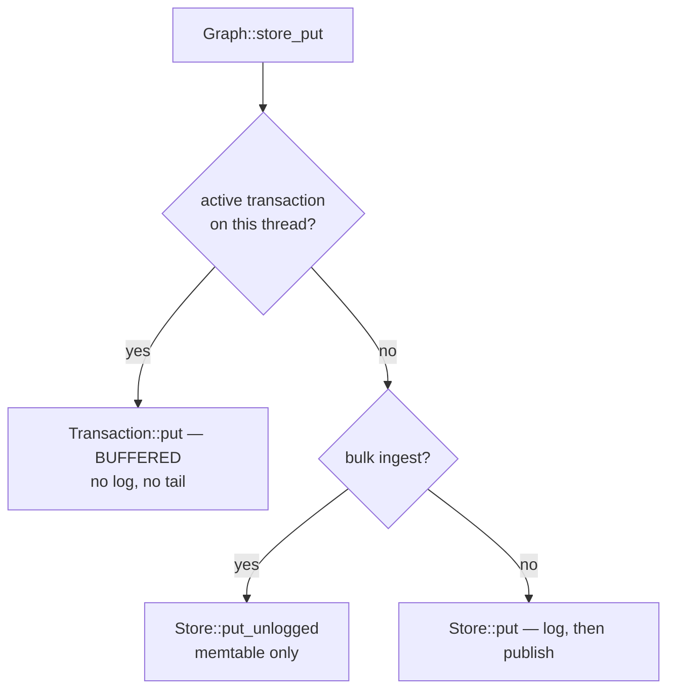
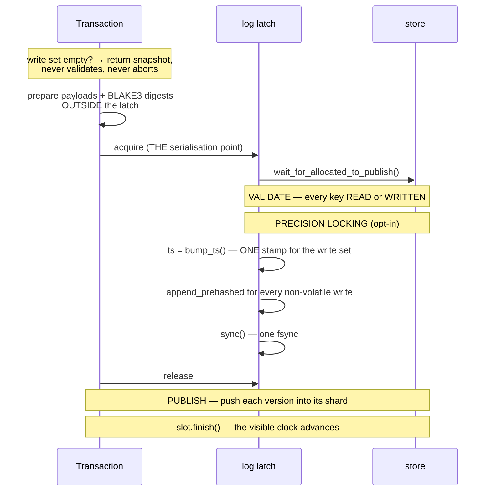

# The write path

From a `CREATE` on the wire to bytes on disk, and what each step protects.

## The rows a write produces

A node is one record row plus one membership row per label. A relationship is
more:

```text
NODE                       KIND::NODE, body = id
'L' ‖ label:u32 ‖ node:u64                 label membership

EDGE                       KIND::EDGE, body = id
'O' ‖ src:u64 ‖ type:u32 ‖ dst:u64 ‖ rel:u64   out half-edge
'I' ‖ dst:u64 ‖ type:u32 ‖ src:u64 ‖ rel:u64   in  half-edge
'G' ‖ node:u64                                 OCC guard, per endpoint
'U' ‖ …                                        uniqueness marker, if constrained
```

The two half-edges are why traversal in either direction is a contiguous range
scan: the sort order *is* the index. See [Key encoding](./key-encoding.md).

The guard rows are the interesting ones — see [below](#guard-rows).

## `create_rel`, step by step

```rust
let _fence = self.fence();                    // clamp derived publishes
let id = self.next_id("rel")?;                // reserved in ranges
self.enforce_rel_constraints(...)?;           // marker rows
store_put(rels_prefix,  id,           record);
store_put(index_prefix, adjacency_row(b'O', src, ty, dst, id), empty);
store_put_volatile(index_prefix, guard_row(src), empty);   // NOT logged
store_put_volatile(index_prefix, guard_row(dst), empty);
store_put(index_prefix, adjacency_row(b'I', dst, ty, src, id), empty);
self.stats_change(...);
self.note_adjacency_changed(ty, src, dst, stamp);   // the change log
```

Two details:

- **Guard rows are written *volatile***: visible for conflict detection, but not
  appended to the commit log. They are a concurrency-control artifact, not data,
  so replaying them would be replaying a lock.
- **`note_adjacency_changed`** appends to the [derived-structure change
  log](./derived-structures.md), so a reader catches up in O(delta) rather than
  rebuilding.

## Where a put goes



## Autocommit is a transaction

A Bolt write statement does **not** take the single-put path. With serialisable
autocommit on (the default), `BoltServer::run` wraps it:

```rust
loop {                                  // RETRIES = 4096
    let txn = graph.open_txn();         // pins a snapshot
    let (txn, r) = graph.with_txn(txn, || run_stmt(...));
    match graph.commit_owned_reporting(txn) {
        Err(TxnConflict) => {
            counters::AUTOCOMMIT_RERUNS.inc();
            record_conflict_class(key);
            // optionally escalate onto FIFO locks
            continue;
        }
        Ok(_) => { counters::record_win(attempt); break }
    }
}
```

This is what makes `SET n.hits = n.hits + 1` safe under concurrency. No latch
inside the write path can cover a read that happened before it — see
[Transactions and isolation](../using/transactions.md).

## Commit



### The digest is computed outside the latch

Deliberately. The chain makes the log latch the serialisation point of every
write, and hashing the payload inside it was the largest serialised cost left
after the tail was sharded. Outside, the serialised section is a 40-byte hash.

### Validation covers reads as well as writes

That is what lifts a transaction "above bare snapshot isolation toward
serializability: **a stale READ that fed a decision aborts rather than
commits**."

It is answered from a **commit window** — a ts-monotone ring of recent commits —
by taking the suffix above the snapshot and keeping the last entry per key. That
gives exactly what a point lookup per key would find, without doing one per key
under the latch. A transaction older than the window falls back to the point
loop, which is also the better answer there: a long-running transaction's window
would be enormous.

### One timestamp

`bump_ts()` is called once, and every write in the set carries it. That single
value is the atomic visibility point: before it, none are visible; after it, all
are. There is no window in which half a transaction can be observed.

### Log, then publish

A named crash point sits between them, so the simulation can kill the process
exactly there.

The reverse order would let a crash leave a version readable that no log entry
accounts for — divergence rather than data loss, and worse.

### An fsync failure aborts

`StoreError::Durability` means the write was **unwound**, not that it
half-happened. In group commit, an fsync failure aborts the process, because the
held replies are unsent and continuing would acknowledge writes that are not
durable.

## Guard rows

Creating a relationship writes a guard row under each endpoint. Their purpose is
to make two writers touching the same node conflict — but that turned out to be
too broad.

Two relationship writes to one hub node wrote the **same** guard row and aborted
each other, conflicting over nothing real. On one shape, a conflict-class
counter attributed **guard 273 / entity 297** — guard rows were ~48% of all
re-runs.

The **guard exemption** recognises the case: two *puts* of the same guard row,
neither in a read set, do not conflict. Worth **3.7×** on the shared-endpoint
shape. `--no-guard-exemption` restores the old behaviour as the control.

Note the shape of that fix: it was gated on a counter *proving* guard rows were
the cause first. Three theories had already died to instruments elsewhere in the
same campaign.

## Id allocation

Ids reserve in ranges — 256 serving, 4,096 in bulk mode. The allocator holds a
global mutex across a durable counter write, so a reservation removes it from
N−1 of every N allocations.

Ids stay dense within a run; **a restart abandons the unused tail as a gap.**

## After commit

`Graph::commit_owned` replays the transaction's touched set — labels,
properties, adjacency, vectors, statistics deltas — into the derived-structure
change logs, **stamped with the commit timestamp**.

That is what lets readers catch up in O(delta). The stamp must come from the
same critical section as the entries; reading the clock separately is the
stale-stamp hazard [derived structures](./derived-structures.md) describes.

## Delete

`delete_node(id, detach)` refuses a node that still has relationships unless
`detach` — `GraphError::StillConnected`. `DETACH DELETE` removes the incident
relationships first.

Deletes write **tombstones**, which compaction drops once no base segment
shadows the key. The tombstone ratio (0.2, floor 4,096 versions) is a
compaction trigger of its own, so a delete-heavy workload compacts on the
tombstones rather than waiting for the segment count.

## Next

- [The storage engine](./storage-engine.md) — the tail, seal and compaction.
- [The commit log](./commit-log.md) — the chain and the WAL.
- [Transactions and isolation](../using/transactions.md) — what commit
  guarantees.
