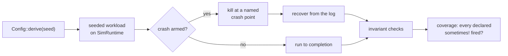

# Deterministic simulation

**One seed is one run.** A seeded, swarm-configured workload on a simulated
shard, ending in the invariant checks every run must pass.

```sh
cargo test -p engram-sim --test sweep
ENGRAM_SWEEP_SEEDS=500 cargo test -p engram-sim --test sweep
```

## What a failing seed gives you

**The seed.** Every run is deterministic, so `SEED=n` reproduces the failure
exactly.

A failure here is a **repro, never a flake** — which is the entire reason
[D1](../architecture/three-decisions.md) exists. Without injected time and an
owned scheduler, a simulation lane still runs, still goes green, and still
produces a coverage report; it just is not reproducing anything.

The source's word for that is **theatre**.

## Swarm configuration

The per-seed `Config` is **derived from the seed** — not fixed, and not passed
in:

| dimension | range |
|---|---|
| writers | 2–8 |
| ops per writer | 4–15 |
| key space | 1–6 |
| seal cadence | 0–7 |
| compact cadence | 0–2 |
| crash injection | p = 1/3 |
| tamper checks | p = 1/3 |
| pinned reader | p = 1/2 |

A fixed config explores one narrow slice for ever. Varying the config *with* the
seed means the sweep walks the **configuration space as well as the schedule
space** — and it costs nothing, because the config is a pure function of a
number you already have.

## The coverage floor

This is the mechanism that makes the sweep worth running.

> **A `sometimes!` event that never fires is a build failure, not neutral.**

Any declared event that does not fire at least once across a sweep **fails the
sweep**.

### Why it needs declaration

If events only came into being by *firing*, then "never fired" and "does not
exist" would be the same observation. An empty coverage report would read as a
clean run, and a simulation that never injected a fault would pass everything.

Declaring an event at construction is what makes its **absence a measurable
fact** rather than an absence of facts. That is why
[D3](../architecture/three-decisions.md) requires registration.

### It paid immediately

The first sweep failed with **seven never-fired events**, and every one was a
real gap in the harness:

- tamper checks running outside the trace,
- a workload that never constructed a contended CAS,
- a codec path nothing exercised,
- two executor states no scenario reached.

The crate's own documentation calls this *the house defect, in the layer built
to detect the house defect* — which is the honest description.

## What a seed exercises



Real store operations, not a model of them: `engram-sim` depends on every other
crate, and the workload drives the actual store, log and codec.

### Crash points

Named places the harness can kill the process, declared by the subsystem that
owns them:

| crash point | between |
|---|---|
| `store.before_log_append` | preparing a write and logging it |
| `store.between_log_and_publish` | the log append and the tail push |
| `graph.between_node_and_membership` | a node record and its membership rows |

That second one is the WAL rule made testable: **log, then publish**. Killing
exactly there and asserting what recovery does is what turns an ordering
argument into a test.

### Invariants

Every run ends with checks that must hold regardless of what the seed did —
including that the hash chain verifies, that recovery produces the state the log
implies, and that no partially-applied write is visible.

## `SimRuntime` is a real executor

A ready queue, a timer heap and a virtual clock — **not** a thin wrapper
deferring to a runtime it does not control.

If the simulation did not own scheduling, it could not reproduce it. That is
also why `Runtime::rand_u64` takes `&self` rather than `&mut self`: randomness
is drawn from the runtime the whole shard shares, so the **draw order** is part
of the run. A per-caller generator would make two runs diverge whenever
scheduling shifted which task drew first — precisely the divergence the gate
exists to catch.

## Parallel code, tested without threads

`SerialExec` implements the [`ScopedExec`](../architecture/concurrency.md) seam
at width 1, running the morsel machinery — split, slot collection, ordered
merge — **inline and deterministically**.

So the simulation covers parallel execution *logic* without threads, and the
determinism digest is unaffected by whether parallelism is available.

A database owning its own thread pool cannot make that separation.

## The determinism gate is not this

Worth distinguishing, and the project's own notes are blunt about it.

`cargo xtask determinism` runs a **`SimRuntime`-only** workload that never
touches the store, graph or Bolt, and compares two fresh runs to *each other*
rather than to a pinned constant. Acceptance clauses of the form "the digest is
unchanged" were, for a while, vacuous.

The real instruments for store behaviour are **this sweep**, A/B differential
tests with fired-counter canaries, and seeded one-worker-versus-six-worker
equivalence runs.

## Running more seeds

```sh
ENGRAM_SWEEP_SEEDS=5000 cargo test -p engram-sim --test sweep --release
```

CI runs the default 48. More seeds explore more of the space; the cost is linear
and the failures remain reproducible.

## What it does not cover

- **No network** — `engram-server`'s threads and sockets are outside the
  envelope by construction.
- **No real object storage** — the seam is simulated against a memory tier plus
  a fault tier.
- **Not a model checker.** It explores seeds, not all interleavings; Loom-style
  interleaving search is named as the complement, not as something this does.

## Next

- [The three decisions](../architecture/three-decisions.md) — D1 and D3.
- [Testing](./testing.md) — the rest of the suite.
- [Counters and observability](../reference/observability.md) — the trace.
