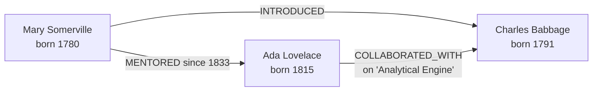

# Your first graph

[Getting started](./getting-started.md) proved the connection works. This page
builds a small graph and asks it the kind of question you would use a graph
database for — one that would need a join per hop in SQL.

Every query and every result below was run against a live server. If you follow
along on an empty `--data-dir`, you should see the same rows.

## The graph

Three people and the relationships between them:



## Create the nodes

```cypher
CREATE (ada:Person     {name: 'Ada Lovelace',    born: 1815}),
       (charles:Person {name: 'Charles Babbage', born: 1791}),
       (mary:Person    {name: 'Mary Somerville', born: 1780})
```

`Person` is a **label** — a set a node belongs to, used to scan and to index.
`name` and `born` are **properties**. `ada`, `charles` and `mary` are variables
that exist only for the duration of this statement.

## Connect them

A relationship needs both endpoints bound first, so each of these is a `MATCH`
that finds the two nodes and a `CREATE` that joins them:

```cypher
MATCH (a:Person {name: 'Mary Somerville'}), (b:Person {name: 'Ada Lovelace'})
CREATE (a)-[:MENTORED {from: 1833}]->(b)
```

```cypher
MATCH (a:Person {name: 'Mary Somerville'}), (b:Person {name: 'Charles Babbage'})
CREATE (a)-[:INTRODUCED]->(b)
```

```cypher
MATCH (a:Person {name: 'Ada Lovelace'}), (b:Person {name: 'Charles Babbage'})
CREATE (a)-[:COLLABORATED_WITH {on: 'Analytical Engine'}]->(b)
```

Relationships are **directed** and **typed**, and they carry properties of
their own — `MENTORED` has a `from` year. The direction is stored, but you can
traverse against it or ignore it when you query.

## Ask it things

### Everyone, oldest first

```cypher
MATCH (p:Person)
RETURN p.name AS name, p.born AS born
ORDER BY p.born
```

```text
name               born
Mary Somerville    1780
Charles Babbage    1791
Ada Lovelace       1815
```

### Every relationship

`type(r)` gives a relationship's type as a string, which is how you get at it
when the pattern does not name one.

```cypher
MATCH (m:Person)-[r]->(p:Person)
RETURN m.name AS from, type(r) AS rel, p.name AS to
ORDER BY from, to
```

```text
from               rel                  to
Ada Lovelace       COLLABORATED_WITH    Charles Babbage
Mary Somerville    MENTORED             Ada Lovelace
Mary Somerville    INTRODUCED           Charles Babbage
```

### Who could Mary reach, in one or two hops?

This is the query that makes a graph database worth the trouble. `[*1..2]` is a
**variable-length path**: follow between one and two relationships of any type.

```cypher
MATCH (m:Person {name: 'Mary Somerville'})-[*1..2]->(p:Person)
RETURN DISTINCT p.name AS reached
ORDER BY reached
```

```text
reached
Ada Lovelace
Charles Babbage
```

Charles appears once, though there are two ways to reach him — directly via
`INTRODUCED`, and in two hops through Ada. `DISTINCT` collapses them.

Raise the bound to `[*1..5]` and the query does not get more complicated, only
deeper. That is the property that does not survive translation to SQL, where
each extra hop is another join.

### How connected is each person?

`OPTIONAL MATCH` is a left join: it keeps rows whose pattern found nothing,
binding `r` to null instead of dropping the person.

```cypher
MATCH (p:Person)
OPTIONAL MATCH (p)-[r]->()
RETURN p.name AS name, count(r) AS out
ORDER BY out DESC, name
```

```text
name               out
Mary Somerville    2
Ada Lovelace       1
Charles Babbage    0
```

Charles is the reason `OPTIONAL` matters. With a plain `MATCH` he would not
appear at all, and "no outgoing relationships" would be indistinguishable from
"not a person". `count(r)` counts non-null values, so his row correctly reads 0
rather than 1.

## Prove it survived

Stop the server, start it again on the same `--data-dir`, and read the third
startup line:

```text
[engram-server] listening on bolt://127.0.0.1:7687
[engram-server] durable: ./data/engram.wal
[engram-server] warmed in 0 ms: 3 nodes, 3 out-edges, 3 in-edges, 8 adjacency table(s) holding 0 MB in 0 MB allocated
```

Three nodes and three relationships, replayed from the log and counted before
the listener opened. Re-run any query above and the answers are unchanged.

The `8 adjacency table(s)` are [derived structures](../architecture/derived-structures.md) —
one per (relationship type, direction) — rebuilt at startup so your first query
does not pay for them. On a graph this size that is instant; the mechanism
exists because on a large one it is not.

## What to read next

- [Core concepts](./core-concepts.md) — what labels, tokens, properties and
  commit timestamps actually are underneath.
- [Cypher support](../using/cypher-support.md) — what this engine accepts, and
  the specific things it refuses.
- [Schema, indexes and constraints](../using/schema.md) — `MATCH (p:Person {name: …})`
  scanned every `Person` here. On a real graph you would index that.
